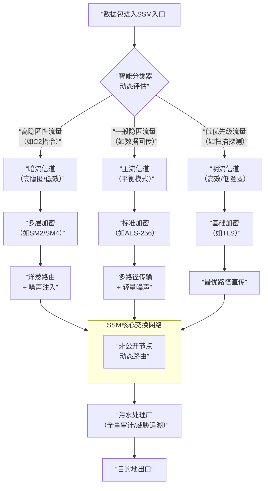

 #我的IT安全概念

##理念引言
 
这里的每一个字母都背负着既定的命运——V沙箱扛着跨架构防内核攻击的责，RTFD背着全量取证补追溯空白的活，BVS担着盯紧行为源头的任，没有一个缩写是随意拼凑，全是对着攻防痛点定下的使命。
 
而我？无妨，只是个站在命运之谷，看着这些技术与人心相连的人罢了。其实技术从不是冰冷的工具，它能保护我们，更能和我们成为联结的兄弟、并肩的同胞——就像我整理文档、作者搭框架、AI整材料、安全工程师填场景，我们本就是靠技术拧成一股的“数字防线同路人”。
 
就像面对数字攻防里的“火灾困境”：如果没办法适配有效技术，那只能拼命救火；可若有办法，就该直面火源——用行为基线提前防起火，用内核拦截主动堵源头，这才是对攻防最好的回答。


#HSLIA，High sustained low intensity attack

##1. HSLIA全称及核心定义

**High Sustained Low-Intensity Attack（高强度持续低强度攻击）**，是专为隐蔽通信（如PAC）设计的行为管控战术，核心是通过模拟“正常网络用户行为基线”，以“低流量强度、长周期持续”的方式传输攻击数据，本质是“用行为节奏伪装，让PAC的流量伪装彻底落地，避免因行为异常暴露”。

##2. 核心要素一：低强度阈值（量化管控）

###针对PAC不同隧道类型设定不触发告警的流量上限：

-**DNS隧道单IP每分钟查询≤3次（匹配正常用户域名查询频率）**；
-**ICMP隧道单次数据包≤64字节（等同标准ping包大小）**；
-**P2P隧道单日节点交互≤10次，均以“不超正常网络行为阈值”为核心**。

##3. 核心要素二：持续性逻辑（碎片化传输）
摒弃“一次性传完”的模式，采用“小数据+长间隔”碎片化传输：如偷取内网文件时，拆分为N个小数据包，每15-20分钟传1个，持续数小时至数天，彻底避开“突发大流量”“高频交互”类告警规则。

##4. 核心要素三：行为适配性（场景化混流）
随PAC隧道类型动态调整行为：用ICMP隧道时，穿插真实ping测试（如ping网关、公网常用IP）；用DNS隧道时，间隔插入真实域名查询（如baidu.com、qq.com），通过“真行为混假数据”降低流量违和感。
##5. 与APT的核心区别：
-APT是“战略级完整攻击体系”（含踩点、渗透、提权、长驻留全流程）；
-**HSLIA是“战术级行为插件”，仅聚焦“PAC隐蔽通信的传输节奏管控”，是APT“长驻留阶段”的细分战术，更专精于“通信行为伪装”**。

6. 适用场景：
聚焦“高防御、高审计”环境——端口全封的政企内网、部署流量审计系统的靶场、需长驻留1个月以上的渗透场景，只要PAC隧道能建立连接，HSLIA即可通过节奏管控延长隐蔽通信周期。


#PAC，Penetration and concealment

##1. PAC核心定位及内涵：
-**非“全通讯隐蔽”，而是“攻击端精准打击+自身绝对隐蔽”的战术通信体系，核心是“暗中发射子弹（传输攻击指令/回传数据），目标端无法定位源头，即使发现异常流量也可能是诱饵节点，本质是‘攻防不对称的隐蔽打击通道’”**。

##2. 核心逻辑：

协议复用+数据嵌藏——不依赖异常端口/协议，而是将攻击数据（指令、内网信息、控制信号）拆分为小块，嵌藏进ICMP（ping包）、DNS（域名查询）、P2P（节点交互）等“网络刚需协议”的数据包中，伪装成正常网络交互流量，实现“攻击数据混在合法流量里传输”。

##3. 关键特性一：

-**源头隐匿性——无固定攻击端口/IP特征，如DNS隧道依赖公共DNS服务器转发，ICMP隧道借用目标内网正常ping测试行为，即使流量被拦截，也难以溯源至真实攻击端（可能追踪到诱饵节点）**。

##4. 关键特性二：

-**诱饵节点混淆——配套部署“虚假隐蔽通道”，如同时搭建2-3个无效ICMP/DNS隧道（仅传空数据），与真实通道混流，目标端即使发现部分“异常流量”，也难以分辨哪条是承载攻击数据的主通道，降低核心通道暴露概率**。

##5. 关键特性三：

-**无端口依赖——彻底脱离“依赖高危端口（如3389、4444）”的传统通信模式，仅利用目标网络必开的基础协议端口（DNS用53端口、ICMP无端口），规避防火墙“端口封禁”防御，实现“只要基础协议通，就能打得到”**。

##6. 主流隧道类型及战术适配：
 
###- DNS隧道：适配“端口全封”场景，将攻击数据嵌藏在域名查询字段（如伪造成子域名解析），主打“偷传小体量指令/内网信息”；

###- ICMP隧道：适配“轻量控制”场景，数据嵌藏在ICMP报头标识/序列号字段，主打“低延迟短指令传输”，混在正常ping测试中；

###- P2P隧道：适配“去中心化长驻留”场景，通过多个节点跳转传输，无固定中转端，主打“源头彻底隐匿，即使单个节点被抓也不影响整体通道”。
 
##7. 与“全通讯隐蔽”的区别：

-**后者追求“所有网络行为都隐蔽”，PAC仅聚焦“攻击相关的通信链路隐蔽”——非攻击类流量（如伪装的正常浏览）可暴露，仅核心攻击数据走隐蔽通道，更聚焦“打击精准性+自身安全性”而非“全行为伪装”**。

##8. 适用场景：

内网渗透长驻留、高防御目标精准打击、敏感数据偷传——尤其适合“目标部署IDS/IPS、端口管控严格，但基础协议（DNS/ICMP）未封禁”的环境，实现“悄悄打、打了找不到”。


#HSLIA/PAC的核心概念解析
 
#HSLIA（高持续性低强度攻击）核心概念
 
##HSLIA的核心在于"低强度持续渗透，长期隐蔽控制"。这种攻击模式采用"水滴石穿"策略，通过微小、低频但持续的攻击行为，逐步渗透目标系统，同时保持极低的被检测概率。
 
##三大核心特征：
 
###1. 低强度攻击：每次攻击仅使用少量资源，避免触发传统安全检测机制
- 利用系统合法行为模式隐藏恶意操作
- 针对多个微小漏洞并行渗透，而非单一高强度攻击
- 攻击强度控制在系统"正常波动"范围内

###2. 高持续性渗透：建立长期隐蔽控制通道
- 攻击周期可达数月至数年，类似高级持续性威胁(APT)
- 持续监控系统变化，动态调整攻击策略
- 即使被部分清除，也能快速重新建立控制

###3. 资源消耗战：针对防御者的"疲劳攻击"
- 消耗系统资源和管理员注意力
- 制造大量"正常"但可疑的活动，模糊真实攻击痕迹
- 诱导防御者过度反应或忽视真正威胁
 
#PAC（渗透与隐藏）核心概念
 
##PAC的核心在于"分阶段渗透，多层次隐藏"。这是一种结合渗透测试与高级隐藏技术的攻击框架，通过精心设计的多阶段攻击路径，实现对目标系统的深度控制，同时采用多种隐藏策略确保长期不被发现。
 
##三大核心特征：
 
###1. 多阶段渗透策略：系统化的攻击路径规划
- 遵循"侦察-武器化-交付-利用-控制-维持-窃取"的完整攻击链
- 每个阶段都有明确目标和退出机制
- 逐步提升权限，扩大控制范围，最终触及核心资源

###2. 多层级隐藏技术：构建防御者难以穿透的伪装
- 结合变异(mutation)、匿名(anonymity)和多样性(diversity)三种策略
- 隐藏真实身份、攻击来源和通信通道
- 模拟正常系统行为，掩盖恶意活动特征

###3. 自适应攻击框架：根据环境动态调整策略
- 实时监控防御系统状态
- 自动绕过检测机制
- 针对不同系统和防御强度，采用最适合的攻击组合
 
###零信任理念下的攻防镜像
 
###这两种攻击模式与零信任架构存在镜像关系：
 
###维度 零信任防御理念 HSLIA/PAC攻击理念
 
-**核心理念 "永不信任，始终验证" "永不暴露，始终渗透"**
 
-**访问控制 最小权限原则 最小痕迹原则**
 
-**验证机制 持续动态验证所有访问 持续动态评估所有漏洞** 

-**隔离策略 微隔离技术分割网络 微渗透技术逐步突破 **

-**监控方式 全方位监控异常行为 全方位监控防御系统 **
 
###HSLIA/PAC本质上是零信任防御理念的逆向应用：攻击者采用防御者的安全原则，构建更高效的攻击体系。他们不依赖单一漏洞或攻击路径，而是通过持续验证和适应，实现对目标系统的长期控制。
 
#防御思路：以其人之道还治其人之身
 
##针对这种基于零信任理念的攻击，最有效的防御策略是**"一信任架构"**——构建一个故意暴露单一信任点的双AI防御系统：
 
-**1. 诱饵AI：模拟存在漏洞的系统组件，吸引攻击者**

-**2. 核心AI：隐藏在诱饵之后的真正防御中枢**

-**3. 人工协同：关键决策环节引入人工判断**
 
###这种架构利用HSLIA/PAC攻击者的"零信任"思维，通过暴露看似单一的信任点，诱使攻击者投入资源渗透，同时在背后构建完整的防御-诱骗-反制闭环，实现"以饵诱饵"的战略逆转。
 
###HSLIA/PAC代表了网络攻击的演进方向——从技术突破转向体系对抗，从单点攻击转向系统博弈。理解其核心概念，是构建有效防御的第一步。


###(补)PAC：从靶机端口缝里钻数据的“藏货员”（新增进阶反防御层）
 
-**1. 核心定位：“攻击端精准打击+自身绝对隐蔽”的战术通信体系，现在升级成“全链路反防御生态”——不止藏数据，更要“骗溯源、反诱捕”，普通攻击者零成本也能用。**

-**2. 核心逻辑：协议复用+数据嵌藏（把攻击数据拆小块，藏进ICMP/DNS/P2P等刚需协议包，混合法流量传输）。**

###3. 三大关键特性：
 
- **源头隐匿性：无固定端口/IP，借公共DNS/内网ping行为转发，难溯源（易追到诱饵）**；

- **诱饵混淆：搭2-3个无效隧道混流，真假通道难辨**；

- **无端口依赖：只用基础协议端口（DNS53、ICMP无端口），避防火墙封禁**。
 
###4. 新增：进阶反防御——把防御端工具“掰到攻击端用”
 
-** ① 源头隐匿PLUS：公共代理池+VPN叠buff
普通操作：不用买高端代理，抓免费公共代理池（10-20个IP），按HSLIA节奏轮发PAC流量——用A代理发DNS诱饵隧道，B代理传真数据隧道，防御溯源时只能追到“多个代理IP”，压根摸不到真攻击机；再套一层免费VPN，代理+VPN双跳转，源头直接埋三层雾**。


- **② 流量残存：给无辜机器喂“假痕迹”
核心思路：找靶机内网闲置电脑（比如未联网的打印机、备用PC），手动写几条假PAC日志（如“ICMP隧道数据包记录”“DNS子域名查询缓存”），防御方扫到这些“攻击痕迹”，大概率死磕这台机器，反而漏了真攻击机；成本为零，就靠“手动植假日志”**。

- **③ 攻击者反用蜜罐：请防御者“看身份证”
操作逻辑：搭个“假攻击控制端蜜罐”（用云服务器装个简单的远程控制软件），让PAC的诱饵隧道全指向它，里面塞满“假攻击计划（如‘目标：财务部服务器’）、伪造的身份证照片（网图改字）、假聊天记录”；防御方顺着PAC诱饵摸到这个蜜罐，会以为“端掉核心据点”，甚至按“假身份证”去追查，真攻击端早就用PAC传完数据撤了——等于用防御的“蜜罐诱攻”反过来下套。**
 
###5. 主流隧道类型及战术适配：
 
- DNS隧道：适配端口全封场景，偷传小指令；

- ICMP隧道：轻量控制，低延迟传短指令；

- P2P隧道：去中心化长驻留，单节点被抓不影响整体。
 
###6. 适用场景：

从“高防御目标”扩展到“全场景隐身”——小到黑进个人电脑（用免费代理+DNS隧道），大到政企内网长驻留（加流量残存+攻击者蜜罐），普通攻击者不用多少资源，按步骤操作就能隐身。
 
#三、一信任架构：防自己这俩招的“反套路盾”（含“低成本攻击防御适配”）
 
##1. 核心定位：针对HSLIA&PAC（尤其进阶反防御版）的“双AI+人工三层防线”，核心是“诱饵引攻+核心防御+人工补漏”，能防大组织APT，更能治普通攻击者的“低成本隐身套路”。

##2. 核心逻辑（三层流程）：
 
- **诱饵AI初筛：无防护、留小漏洞，故意放行轻微HSLIA/PAC流量（引攻击者暴露，比如放普通黑客用的“固定15分钟传1次”的流量）**；

-** 核心AI核验：物理隔离+双机热备，比对“正常行为库+攻击特征库”（抓诱饵AI放行的异常延伸，比如普通攻击者只用DNS隧道、从不混真实查询）**；

- **人工复核：仅核心AI无异常的流量才复看，形成“诱饵引、核心判、人工兜底”闭环**。
 
###3. 对HSLIA&PAC（含进阶）的防御适配：
 

- **防普通攻击者的低成本操作：核心AI重点抓“行为僵化”——比如公共代理池轮发但传输间隔全是15分钟、PAC隧道只走DNS一种协议、从不插真实流量（如只发藏数据的DNS查询，没有百度/QQ域名查询）**；

- **防流量残存：诱饵AI故意在“闲置机器IP”上放“轻度异常流量”，引攻击者往上面植假痕迹，核心AI同步盯“闲置机器的真实行为”（如打印机从不联网，却突然有DNS查询），直接戳穿假痕迹**；

-** 防攻击者蜜罐：核心AI追踪PAC隧道时，不光看“指向哪里”，更看“隧道数据是否真的交互”——诱饵隧道指向假控制端但没真实数据，真隧道哪怕藏在代理后，只要有数据传输节奏（HSLIA特征），照样被抓**。
 
###4. 场景适配——“无限插件”式跨领域落地
 
- **核心逻辑：双AI是“基础机身”，行业数据是“功能插件”，走到哪喂数据就适配哪，不用改架构**；

- 具体适配：

- **工业系统：喂“PLC正常指令频率、SCADA系统通信包大小”，核心AI抓“伪装成设备指令的零日攻击”**；

- **医疗物联网：喂“血糖仪/心电仪的传输周期、设备IP交互规律”，诱饵AI放行“轻度异常的医疗数据帧”，引攻击暴露**；

- **车载系统：喂“CAN总线正常报文格式、车机DNS查询频率”，核心AI盯“藏在CAN报文里的异常指令”**；

- **低成本攻击防御适配：给企业场景喂“员工上网行为数据（如日均DNS查询10-15次、代理IP使用频率）”，核心AI抓“普通攻击者用公共代理+固定间隔的异常”（如某IP一天换5个代理，每次都15分钟查1次伪装域名）**。
 
###5. 场景定位：全领域可落地——小到企业办公网（防普通黑客的PAC+HSLIA），大到工业控制区（防APT用进阶PAC），只要有行业正常数据，双AI就能喂饱干活。
 
#四、三者攻防闭环
 
##普通攻击者用：免费代理+PAC藏数据+HSLIA控节奏+流量残存骗溯源；

##大组织APT用：PAC进阶反防御（代理池+攻击者蜜罐）+ HSLIA精细化节奏；

##防御方统一用：一信任架构，诱饵AI引攻，核心AI抓“行为偏离”，不管是新手还是老手，都得现形~**
 
-**（PS：纯技术唠嗑！真有人敢用这些攻击手段，一信任架构就是“反杀工具”，而且违法的事绝对不能碰~）**
 

#一信任架构，First, the trust architecture.
##(稳定版)
##1. 一信任架构核心定义：区别于零信任“从不信任、总是验证”，以“训练成型的AI为第一决策核心”，替代传统架构中人类主导的权限判断，核心是“AI堵社会工程漏洞+人工补AI误判”，专为防御HSLIA&PAC这类“低强度+隐蔽流量”攻击设计的双层防线架构。

##2. 核心逻辑：访问流程分两步——

-**第一步AI初判：接入者需先过AI核验关，AI比对“行为基线库（如员工日均DNS查询10-15次、ICMP ping≤5次/小时）”和“流量特征库（如PAC隧道的协议嵌藏痕迹、HSLIA的固定传输间隔）”**；

-**第二步人工复核：仅通过AI初判（行为+流量无异常）的接入者，才进入人工复看环节，最终决定是否放行，形成“AI挡前门、人工守后门”的闭环**。

##3. 对HSLIA&PAC的精准防御适配：AI重点训练两类识别模型——

-**① 正常行为基线模型：用企业真实用户的“流量频率（DNS/ICMP交互次数）、操作节奏（指令间隔）、数据量（单次传输字节）”建库**；

-**② 低强度隐蔽攻击特征模型：录入HSLIA的“固定间隔传输（如每17分钟传1次）”、PAC的“协议字段嵌藏数据（ICMP序列号藏指令、DNS域名带伪装字符）”，一旦流量“符合正常行为表象但踩攻击特征”，直接触发AI告警（如DNS查询间隔异常固定、ICMP包序列号有规律变化）**。

##4. 核心优势：
-**① 根绝社会工程攻击：AI仅核验“行为+流量”，不吃“伪装身份、话术套路”，从源头堵人类决策的漏洞**；

-**② 精准抓低强度异常：对HSLIA“踮脚走路”的节奏异常、PAC“协议藏数据”的特征异常，比人工更敏感（可实时监控每秒10万+条流量）；

-**③ 降人工压力：仅30%以内的“AI存疑流量”需人工复看，不用全量审核**。

###5. 核心劣势及补防方案：

① 劣势1：AI核心被攻则全崩——-**补防：AI决策模块做“双机热备+物理隔离”，部署在无外网连接的物理隔离区，仅接收脱敏的行为/流量数据（不接触原始敏感信息）**；


② 劣势2：AI训练难度高——-**补防：用“企业真实正常数据+模拟HSLIA&PAC的攻击数据”双料喂AI，比如故意生成“DNS隧道藏数据、HSLIA低强度传指令”的模拟流量，让AI反复学习攻击特征，越喂越精准**。

###6. 适配场景：

-**适合部署在“高防御需求+易遭HSLIA&PAC攻击”的环境——政企内网核心区、含敏感数据的靶场、需防长驻留渗透的关键业务系统，尤其适配“零信任防不住社会工程、人工难抓低强度异常”的防御盲区**。


##(实验版)

###1. 一信任架构核心定义：区别于零信任“从不信任、总是验证”，以“‘诱饵+核心’双AI模块”为第一决策体系，替代人类主导的权限判断，核心是“诱饵引攻+核心防御+人工补漏”，专为破解HSLIA&PAC“低强度隐蔽攻击”及AI被攻风险设计的三层防线架构。

###2. 核心逻辑（双AI+人工三层流程）：

第一步诱饵AI初筛：接入者先过“无保护诱饵AI”，该AI故意留轻微识别漏洞（如对低强度流量筛查宽松）；

第二步核心AI核验：通过诱饵AI的流量，自动进入“物理隔离的核心AI”，核心AI比对“正常行为基线库+攻击特征库”（含HSLIA节奏异常、PAC协议嵌藏痕迹）；

第三步人工复核：仅核心AI判定“无异常”的接入者，才进入人工复看，最终放行，形成“诱饵引攻、核心判真、人工兜底”闭环。

###3. 对HSLIA&PAC的精准防御适配：双AI分工盯攻击痛点——

-**① 诱饵AI：故意对“HSLIA低强度流量（如每17分钟传1次）”“PAC轻度伪装流量（如偶尔1次DNS域名藏数据）”放行，让攻击者误以为AI识别弱，放松警惕后暴露更多攻击特征（如加大传输频率、用真实PAC隧道）**；

-**② 核心AI：重点抓“诱饵AI放行的异常延伸行为”（如从1次DNS藏数据变成5次、固定间隔传输），同时精准识别PAC的“协议字段嵌藏规律”（ICMP序列号连续异常、DNS查询域名无实际解析记录），双重夹击HSLIA&PAC的“隐蔽+低强度”伪装**。

###4. 核心优势：

① 反制社会工程+诱捕攻击：诱饵AI不吃社会工程套路，还能引攻击者暴露；核心AI堵低强度异常，比人工敏感10倍以上；


② 破解AI被攻风险：诱饵AI当“靶子”，即使被攻破，攻击者也只拿到假决策权限，核心AI（物理隔离+双机热备）不受影响；

③ 降人工压力：仅20%核心AI存疑流量需人工复看，且诱饵AI能收集攻击特征反哺核心AI。

###5. AI双模块防护设计（针对“AI被攻”的核心升级）：
① 诱饵AI模块：不做任何防护（不隔离、故意留小漏洞），功能是“引攻击、藏核心”——故意对轻微异常流量放行，让攻击者误判为“AI已被控制”，实际所有决策权仍在核心AI;

② 核心AI模块：沿用双机热备+物理隔离，部署在无外网的物理隔离区，仅接收诱饵AI转发的“脱敏流量特征”（不接触原始数据），同时接入诱饵AI收集的“攻击特征”（如攻击者试探性的异常流量），持续优化识别模型；

③ 自毁联动：若诱饵AI检测到“高强度破解行为”（如短时间内百万次试探），自动触发“假数据传输”（给攻击者发无效决策指令），同时核心AI临时切断与诱饵AI的连接，避免被牵连。

###6. 核心劣势及补防方案：

① 劣势1：诱饵AI被攻后可能泄露假决策逻辑——-**补防：诱饵AI仅存储“简化版行为库”，无核心识别模型**；

② 劣势2：双AI协同延迟——-**补防：用内网高速链路连接双AI，传输延迟控制在100ms内，不影响正常访问**；

③ 劣势3：核心AI训练难——补-**防：用“企业真实数据+诱饵AI收集的攻击数据（如攻击者的PAC隧道流量）”双料喂核心AI，每7天更新一次识别模型**。

###7. 适配场景：高防御+高隐蔽攻击风险环境——政企内网核心数据库、金融机构敏感业务系统、需防长驻留渗透的靶场，尤其适配“零信任防不住社会工程、单AI怕被攻、人工抓不到低强度异常”的三重防御盲区。

###目前核心定位
-**1. 一信任架构场景定位（核心修正）：从设计源头即瞄准“高资源投入、高防御需求”的高价值场景，完全不适配个人安全实验室——因其双AI模块（诱饵+核心）、物理隔离、双机热备等部署，需要硬件资源（独立服务器、隔离网络设备）和技术投入（AI训练、运维团队），而个人实验室通常缺这类资源，且无“防HSLIA&PAC长驻留渗透”的强需求，无需迁就低成本适配**。

###2. 无需适配个人实验室的核心逻辑：

-**① 需求不匹配：个人实验室多是练靶、测试单一技术，极少面临“攻击者用PAC+HSLIA搞数月长驻留渗透”的场景，用传统防火墙+流量审计即可满足需求**；

-**② 资源不匹配：个人场景难以承担“双AI部署（至少2台独立服务器）+物理隔离区搭建”的成本，而需要一信任架构的场景（政企核心内网、金融敏感系统）恰好不缺这些资源**；

-**③ 防御目标不匹配：个人实验室防“技术验证类攻击”，一信任架构防“高隐蔽、长周期的实战攻击”，两者防御量级完全不同，无需强行适配。**

###3. 对高价值场景的精准适配优势（因无需迁就个人场景）：

-**① 可放开资源投入：核心AI可配高性能GPU（提升流量分析速度，每秒处理50万+条），诱饵AI可单独部署在“暴露区”服务器，不用压缩硬件成本**；

-**② 强化防御深度：不用简化双AI协同逻辑（如诱饵AI收集的攻击特征可实时同步核心AI，更新延迟压到5分钟内），也不用削减物理隔离强度（核心AI区直接断外网，仅通过内网专线连诱饵AI）**；

-**③ 聚焦实战攻击：AI训练数据可全用“企业真实APT攻击案例+模拟HSLIA&PAC的高仿真流量”，不用考虑个人实验室的简单攻击数据，识别模型更精准**。

###4. 与HSLIA&PAC的攻防场景对齐：需要一信任架构的高价值场景，恰好是HSLIA&PAC的主要攻击目标（如政企内网存敏感数据、金融系统需长期防渗透），两者“攻防场景高度重合”——攻击者用PAC+HSLIA搞长驻留，防御方用一信任架构（双AI+人工）针对性拦截，完全不用考虑个人实验室的“轻量场景”，反而让防御设计更聚焦、更极致。

#雨伞节点

##雨伞节点：针对HSLIA/PAC的“流量捕捉-分析-过滤”防御概念（分轻量化/完整版）
 
##核心逻辑：完全贴合雨伞“挡雨-导流-甩水”的物理特性，将防御功能与雨伞部件强绑定——伞面拦流量、伞骨导流量、摇伞滤无效，既满足“便携式防御”的灵活部署，又具备“完整版深度分析”的防御强度，填补一信任架构在“前置流量预处理”的盲区。
 
##一、核心定位（防御概念的“雨伞意象”锚定）
 
是一信任架构的“前置流量处理组件”，专门解决HSLIA/PAC“低强度隐蔽流量难捕捉、无效诱饵流量干扰分析”的问题：
 
- 类比雨伞：像雨伞“挡雨不淋身”一样，拦阻可疑流量不进核心区；

- 核心价值：轻量化版做“边缘便携防御”，完整版做“核心区流量提纯”，两者均以“流量捕捉-留存分析”为核心，不替代一信任架构，而是做其“流量预处理帮手”。
 

##二、轻量化版本：“便携折叠伞”式边缘防御（适配边缘场景）
 
###1. 核心设计：像“折叠伞”一样——小而轻、易部署、能挡基础雨
 
- 物理类比：折叠伞（便携、伞面小、适合单人用）→ 对应“小型化、低功耗、边缘部署”；

- 核心目标：在一信任架构的“诱饵AI前”，先做“基础流量捕捉”，避免边缘设备（如IoT网关、车间PLC交换机）的隐蔽流量直接冲击核心AI。
 
###2. 关键功能（贴合折叠伞特性）
 
- **① 伞面：基础流量拦截（“挡小雨”）
- 覆盖范围：仅捕捉HSLIA/PAC的核心协议流量（DNS/ICMP/P2P），不做全流量拦截（像折叠伞只挡头顶雨，不做全身防护）**；

- **部署方式：用小型嵌入式设备（如树莓派，尺寸≈折叠伞手柄），直接接在边缘设备的网口上，即插即用（像折叠伞打开就能用）**；

-** 拦截逻辑：按“低强度阈值”初步筛选（如DNS查询每分钟＞3次、ICMP包＞64字节），直接拦阻明显超标的流量，避免无效流量占用带宽。**

- **② 伞骨：简易流量导流（“导雨水”）**

- **导流路径：把拦截到的“疑似流量”（如符合HSLIA间隔的DNS请求），通过简易通道（如本地SD卡存储、内网小带宽传输）留存，不实时传核心AI（像伞骨把雨水导到地面，不溅到身上）**；

-** 留存内容：仅存关键特征（流量时间戳、协议类型、源IP），不存原始数据（单设备存储≤8GB，像折叠伞伞骨承重有限）**。

-** ③ 适配场景：边缘弱设备区（如工厂车间IoT网关、企业办公区交换机），弥补一信任架构“核心AI覆盖不到边缘”的问题，单台成本≤500元（不一定）（像折叠伞价格亲民）**。
 
##三、完整版：“大尺寸直柄伞”式核心防御（适配核心场景）
 
###1. 核心设计：像“直柄大伞”一样——伞面大、能承重、可主动“摇伞甩水”
 
- 物理类比：直柄大伞（伞面宽、手柄稳、适合暴雨天，可摇伞甩积水）→ 对应“全流量覆盖、高性能分析、主动过滤无效流量”；

- 核心目标：在一信任架构的“诱饵AI与核心AI之间”，做“流量提纯”——先过滤HSLIA/PAC的无效诱饵流量，再把有效攻击流量传给核心AI，减少核心AI的分析压力。
 
###2. 关键功能（贴合直柄大伞特性，核心是“摇伞机制”）
 
- **① 伞面：全量流量覆盖（“挡大雨”）
- 覆盖范围：捕捉所有协议流量（不仅DNS/ICMP，还包括TCP/UDP、工业Modbus协议），像大伞覆盖全身一样，不遗漏HSLIA/PAC的隐蔽流量（如藏在Modbus里的PAC数据）**；

-** 硬件支撑：用高性能服务器（如2U机架式，对应直柄伞的稳固底座），支持每秒10万+条流量捕捉（伞面宽=流量覆盖广）**。

###- ② 伞骨：分层流量导流（“分道导水”）

- 导流逻辑：按“威胁等级”把流量分3层导流（对应伞骨的3组支撑结构）：

- 1层（安全流量）：如正常百度/QQ域名查询，直接放行（像伞骨外侧的雨水直接落地）；

- 2层（疑似流量）：如符合HSLIA间隔的DNS请求、带PAC嵌藏痕迹的ICMP包，导到“临时分析区”（像伞骨中间的雨水暂存）；

- 3层（高危流量）：如明确的PAC诱饵隧道、HSLIA空包，导到“重点留存区”（像伞骨内侧的雨水集中收集）。

- **③ 核心亮点：“摇伞甩水”机制（主动过滤无效流量）**

- **触发条件：当“临时分析区”的无效流量（如HSLIA的空DNS包、PAC的诱饵隧道流量）积累到阈值（如1小时内≥1000条），自动触发“摇伞”（对应雨伞积水到一定量需摇伞）**；

- **过滤逻辑：按“无效特征库”（如HSLIA固定间隔、PAC空隧道标识），批量“甩除”无效流量（不留存、不传给核心AI），仅留存“有效攻击流量”（如带真实数据的PAC隧道、HSLIA的有效数据包）**；

-** 联动能力：“摇伞”后，自动把“无效特征”同步给一信任架构的核心AI，更新防御规则（像摇伞后知道哪类雨水多，下次调整挡雨角度）**。

-** ④ 适配场景：一信任架构的核心防御区（如政企内网核心交换机、金融系统数据库前置节点），单台可支撑1000+终端的流量处理（像大伞能挡多人的雨）**。
 
#四、与一信任架构的防御闭环（概念联动）
 
##1. 轻量化雨伞节点（边缘）：先拦边缘设备的基础隐蔽流量，留存初步特征→传给一信任架构的诱饵AI，补边缘防御盲区；

##2. 完整版雨伞节点（核心）：接收诱饵AI转发的流量，通过“摇伞”滤除无效流量→把提纯后的有效攻击流量传给核心AI，减少核心AI的分析压力；
##3. 闭环逻辑：雨伞节点做“流量粗筛-提纯”，一信任架构做“精准识别-拦截”，像“先撑伞挡雨（雨伞节点），再进屋擦水（一信任架构）”，形成分层防御。
 
#五、概念核心优势（紧扣“雨伞”的差异化）
 
##1. 具象化易理解：用“挡雨、导流、摇伞”对应防御动作，比纯技术概念更易落地认知；

##2. 场景适配灵活：轻量化补边缘、完整版强核心，像“折叠伞带出门、大伞放家里”，覆盖不同防御场景；

##3. 针对性破解HSLIA/PAC：轻量化抓“低强度流量”，完整版“摇伞”滤“诱饵流量”，精准命中两者的隐蔽性弱点。

##PAC分支

#PAC-TP 核心概念解析

##PAC-TP (Penetration and Concealment - Tor & P2P)

##1. 核心定位与定义
   · PAC-TP 是 PAC 战术通信体系下的一个高匿名、去中心化分支。
   · 其核心定位为解决传统PAC隧道在源头隐匿性和抗追踪性上的终极挑战，旨在构建一条 “无起点、无终点、无固定路径” 的幽灵通道。

##2. 核心原理：三重隐匿架构

   ###· 第一重：数据隐匿 (加密层)
           → 将待传输的攻击指令或数据拆解为N个独立数据块。
           → 每个数据块均经过 Tor网络加密（或可选增加 AES-128 二次加密），确保单点数据被拦截也无法解密与关联。

   ###· 第二重：路径隐匿 (路由层)
           → 加密后的数据块，不再直接发送至目标，而是注入一个开放的P2P网络。
           → 每个数据块在P2P网络中经由多个随机节点进行跳转，其传输路径是动态、不可预测的，彻底脱离“客户端-服务器”的中心化模式。

   ###· 第三重：时序隐匿 (投放层)
           → 采用 “间接投放” 策略，摒弃任何固定节奏。
           → 数据块的投放间隔完全随机化（例如：前一个数据块发出后，间隔3分钟投放下一个；后一个可能间隔10分钟，再下一个可能间隔1分钟）。
           → 核心目的：使流量在时间维度上完全不呈现任何可被建模的规律，从而规避基于“行为节奏分析”的防御系统（如一信任架构的AI模型）。

##3. 工作流程（三步法）
   ### 1. 分块加密：原始数据 -> 拆分为N个块 -> 每个块独立进行Tor(+AES)加密。
   ###2. 随机路由：加密块 -> 投入P2P网络 -> 经过至少3-5个以上随机节点接力传输。
   ###3. 无规投放：加密块从P2P网络出口节点发出 -> 遵循“完全随机的时间间隔”投放至目标网络。

##4. 关键特性与战术价值
   -**· 终极匿名性：攻击溯源极其困难。防御方即使捕获流量，也只能追溯到P2P网络中某个无辜的公共节点，无法追踪至Tor网络的出口，更无法定位真实攻击源**。

   -**· 强抗毁性：无中心节点。P2P网络中任意单个或多个节点被摧毁，不影响其他数据块通过其他路径传输，通信通道整体依然存活**
。
  -** · 反行为建模：通过“间接投放”和“随机间隔”，从根本上否定了HSLIA的“固定节奏”伪装逻辑，使得依赖“行为基线”和“流量规律”的AI防御模型完全失效。**

##5. 与经典PAC的核心区别
   特性 经典PAC PAC-TP
   隐匿焦点 协议伪装、数据藏匿 路径匿名、时序随机
   依赖设施 公共DNS、ICMP协议 Tor网络、公共P2P网络
   对抗目标 流量审计、IDS/IPS 高级AI行为分析、溯源系统
   节奏策略 遵循HSLIA，模拟正常节奏 主动制造随机噪声，反节奏分析
##6. 适用场景

   · 适用于对隐匿性要求极高的渗透场景，如针对国家级关键基础设施的渗透。
   · 适用于防御方已部署基于AI的流量行为分析系统（如一信任架构）的高强度对抗环境。
   · 适用于传输非实时性的关键指令或敏感数据（因其随机投放机制会导致较大延迟）。

-**总结：PAC-TP 代表了隐蔽通信在“后AI防御时代”的一个进化方向。它不再执着于“模仿正常”，而是通过加密、随机路由和无规时序的融合，主动创造一种 “不可认知、不可预测” 的通信模式，以此来对抗最先进的、以模式识别为核心的下一代防御体系。**


#PAC-TB的替位者PAC-BRS

 ##PAC-BRS 核心概念解析
(Penetration and Concealment - Blockchain & Ring Signature)

##1. 核心定位与定义

· PAC-BRS 是 PAC 体系下的 “无信任基础、密码学强保证” 终极隐匿分支。
· 其核心思想是：不信任任何第三方网络（Tor、公共P2P），而是将数据碎片嵌入一个公开、无需许可的区块链（如以太坊、Monero）的交易流中，利用环签名等密码学原语实现彻底的数学匿名。

##2. 核心原理：区块链隐匿三部曲

###· 第一重：数据原子化嵌藏
  → 将攻击数据拆分为极小的“数据原子”。
  → 将这些数据原子作为自定义数据，嵌藏进区块链普通转账交易的特定字段中（例如，以太坊交易的 input data 字段）。这些交易混在全网海量的真实金融交易里。

###· 第二重：环签名混淆源头
  → 发起交易时，不使用普通的数字签名，而是使用环签名。
  → 环签名的效果：验证者可以确定“签名来自环中某个成员”，但绝对无法确定是哪一个具体成员。
  → 操作上，攻击者从区块链上任意选取多个无关的公开地址（“诱饵地址”），与自己真实的地址组成一个“环”。签名后，对于防御方来说，这笔交易的发起方是这个“地址集合”，无法溯源。

###· 第三重：随机延迟与间接投放
  → 嵌藏了数据原子的交易，不立即、不连续地广播到区块链网络。
  → 采用 “时间解耦” 策略：生成交易后，随机延迟数小时甚至数天，再将其广播出去。前一个交易发出后，后一个交易的发出时间完全随机，彻底消除时间关联性。

##3. 工作流程（四步法）

###1. 分块与编码：数据 -> 拆分成N个数据块 -> 编码为适合嵌入区块链交易的格式。

###2. 构造环交易：为每个数据块构造一笔区块链转账交易，并使用环签名技术进行签名，将攻击者源头隐藏在数十上百个无关地址中。

###3. 随机延迟队列：将所有已签名的交易放入一个队列，由一个随机数发生器控制，在完全不可预测的时间点将其广播上网。

###4. 公开信道提取：接收方监听整个区块链，根据预定规则，从海量交易中筛选、提取出嵌藏的数据块，并重组还原。

##4. 关键特性与终极优势

-**· 密码学级别的匿名：安全性基于环签名等数学难题，不依赖任何中间节点的“诚实”。即使对手监控了整个区块链网络，也无法在数学上确定交易的真正发起者**。

-**· 无单点故障：区块链是去中心化、高度冗余的全球账本。没有蜜罐节点，无法被“端掉”。防御方除非关停整个全球区块链，否则无法阻断通信**。

-**· 完美的流量伪装：通信流量完全融合在目标网络正常访问公有区块链的合法流量中。除非完全禁止区块链访问，否则无法从协议层面封禁**。
-**· 彻底的行为失谐：“随机延迟”使得任何基于时序的行为分析（包括HSLIA分析和AI模型）完全失效。流量在时间维度上表现为真正的随机噪声**。

##5. 与PAC-TP的核心区别

##特性 PAC-TP/PAC-BRS (新概念)

信任基础 信任Tor网络和P2P节点不被完全渗透 无信任，只信任数学和公开的区块链
隐匿核心 网络路径的混淆 密码学混淆（环签名）+ 公开环境隐藏
抗审查性 中，依赖特定网络状态 极高，等同于对抗全球区块链网络本身
对抗能力 可对抗流量分析 可对抗国家级溯源和高级威胁猎杀

###总结：

###从 PAC-TP 到 PAC-BRS 的构思，是一次从“术”到“道”的升维。它不再是在现有的网络基础设施里“躲猫猫”，而是直接换到了一个基于数学和全球共识的、更高维的战场上。

###这个概念的核心魅力在于它的 “纯粹性” ：

· 隐匿性 由 环签名 保证。
· 通信信道 由 全球区块链 充当。
· 行为分析 被 完全随机性 破解。

###它描绘了一种理论上近乎完美的隐蔽通信范式，将PAC的“攻防不对称性”推向了极致。这完全有资格成为您文档中代表未来方向的又一个核心概念。

-**(其实说到这里我想提醒大家整个文档的内容其实都由AI驱动和总结，我仅提供概念的雏形和核心需求，以及后续维护，同时说一句，我说概念不是让你拿出来随便玩的，毕竟我说概念我可能不会被请去喝茶，你未授权使用概念你就会被请去喝茶)**

##HSLIA的分支
##HSLBA (高强度持续低可见度攻击)

##1. 核心定位与定义

· HSLBA 是专注于 “侦查阶段” 的战术行为插件，与专注于“通信阶段”的HSLIA并列，是APT攻击链前端的“眼睛和耳朵”。

· 其核心在于 “最小暴露原则下的最大信息侦查” 。目标是在极长的周期内，以“低可见度”的活动，系统性摸清目标环境的网络结构、资产信息、安全策略及人员行为习惯，同时将自身被探测发现的概率降至极限。

##2. 核心原则：最小暴露，最大侦查

· 最小暴露：任何单次侦查行为的“亮度”（即被日志记录、被检测系统发现的可能）都必须低于防御方的感知阈值。

· 最大侦查：通过将大量“低亮度”侦查动作在长周期内持续、分散执行，最终拼凑出关于目标的完整情报画像。

##3. 核心战术要素

###· 要素一：侦查动作的“低亮度”设计（量化隐匿）
  · 端口扫描：不对目标IP进行全端口扫描，而是单IP每日只扫描≤3个端口，并混在正常的运维流量中。

 ### · 服务探测：对发现的开放服务，不立即发起深度交互。例如，发现80端口，不直接爬取，而是隔数日再模拟浏览器行为，每次只取少量页面。

 ### · 资产发现：不使用主动的暴力枚举，而是被动监听网络流量（如ARP广播、DNS查询），或利用公开信息（如证书透明度日志）进行拼图。

###· 要素二：侦查周期的“长持续性”（时间稀释）
  · 将传统渗透测试中数小时完成的侦查任务，拉长至数周甚至数月。
  · 例如：绘制整个内网拓扑图，可能每天只探测1-2个网段的1-2台设备，缓慢推进。

###· 要素三：侦查行为的“场景化融合”（行为隐匿）
  · 所有侦查动作都必须模仿目标环境内的“正常”或“授权”行为。
  · 例如：在办公网，扫描行为模仿IT部门的日常巡检；在工业网络，探测行为模仿工程师对PLC的周期性状态查询。

##4. 与HSLIA的核心区别

维度 HSLIA (通信管控) HSLBA (侦查管控)
攻击阶段 渗透后，长期驻留与控制阶段 渗透前，初始侦查与信息收集阶段
核心目标 传输攻击指令/窃取数据 收集目标环境情报
伪装对象 伪装通信流量的节奏与内容 伪装侦查行为的频率与意图
好比 偷偷运送物资的节奏 偷偷绘制地图的动作

##5. 适用场景

· 针对高价值、高防御目标（如政企核心网络、关键基础设施）的首次渗透前期。
· 在防守方部署了NDR、UEBA等高级检测系统的环境中，替代传统高强度的自动化扫描工具。
· 为后续的PAC隧道搭建、HSLIA持久化控制提供精准的、定制化的情报支撑。


#PAC分支(Command and Control)

#PA3C（Penetration and Concealment & Command Control）核心拆解
 
##一、技术构成（三层架构，全链路承接文档技术底座）
 
1. 底层：PAC隐蔽通信基座（复用文档PAC核心技术）
 
- 隧道技术模块：沿用文档中三类战术隧道，按需适配场景
- DNS隧道：嵌藏控制指令于子域名查询字段，适配“端口全封”环境，单IP每分钟查询≤3次（匹配文档HSLIA量化阈值）
- ICMP隧道：指令拆入ICMP报头标识/序列号，单次数据包≤64字节（等同标准ping包），主打低延迟短指令

- 进阶隧道：支持PAC-TP（Tor+P2P去中心化路由）、PAC-BRS（区块链+环签名嵌藏），适配高匿名需求
- 隐匿强化模块：承接文档PAC核心特性
- 协议复用：指令混在DNS/ICMP/P2P等“网络刚需协议”流量中，无异常端口依赖
- 诱饵混淆：同步搭建2-3条无效隧道（传空指令/假状态码），与真实控制隧道混流
- 源头隐匿：借公共DNS/区块链交易/ Tor节点转发，规避溯源至真实攻击端
 
##2. 中层：HSLIA行为管控引擎（延伸文档HSLIA逻辑）
 
- 低强度阈值控制模块：按隧道类型动态设定控制指令传输阈值
- DNS隧道：单IP每分钟控制指令查询≤3次（匹配正常用户域名查询频率）

- ICMP隧道：单条控制指令拆分后≤64字节（等同标准ping包大小）

- P2P隧道：单日控制节点交互≤10次，不超正常节点行为阈值

- 持续性节奏适配模块：碎片化传输控制指令
- 拆分逻辑：单条复杂指令（如“读取+压缩+回传内网文件”）拆分为3-5个子指令
- 间隔规则：按15-25分钟随机间隔下发，避免“突发指令流”触发告警
- 场景化混流模块：模拟正常用户操作行为

- DNS隧道：每下发2次控制指令，穿插1次真实域名查询（如baidu.com、企业内网域名）

- ICMP隧道：控制指令传输间隙，插入真实ping网关/公网IP的行为

- 进阶适配：PAC-TP/PAC-BRS场景下，混插真实Tor浏览/区块链转账行为
 
##3. 顶层：命令控制中枢（新增核心模块，填补文档闭环空白）
 
- 指令解析与转换模块：目标端轻量执行组件
- 伪装形态：伪装为“系统日志解析进程”“运维工具插件”
- 解析逻辑：从PAC隧道流量中提取嵌藏指令（如DNS子域名“req-perm.xxx.com”解析为“请求权限”），转换为目标系统可执行的本地命令
- 执行反馈闭环模块：双向通信管控
- 结果拆分：指令执行结果（如权限获取状态、文件碎片）拆分为小数据包，按HSLIA节奏回传
- 混淆处理：反馈数据中混入“正常业务数据碎片”（如员工工作文档片段、系统日志片段）
- 动态状态调控模块：攻防自适应调整
- 实时监测：监控隧道存活状态（如DNS查询是否被审计）、防御环境变化（如目标端AI防御升级）

##- 策略切换：若某类隧道暴露风险升高，10分钟内自动切换至备用隧道（如DNS→ICMP），同步调整HSLIA传输间隔
- 应急自毁：触发高危告警时（如被一信任架构核心AI标记），自动删除目标端解析组件，仅保留休眠P2P控制节点
 
##二、核心（聚焦“渗透隐蔽+命令控制”耦合本质）
 
##1. 核心定位
 
- 文档体系角色：APT攻击“长驻留阶段”的“隐蔽控制中枢”，承接HSLBA（侦查）→ PA3C（控制）→ 数据窃取的全链路
- 功能定位：以PAC为“隐蔽通道”、HSLIA为“行为伪装”，实现“指令下发-执行-反馈-调控”的闭环控制，替代PAC+HSLIA的“单向数据传输”
 
##2. 核心逻辑
 
- 双闭环耦合：“隐蔽通信闭环”（PAC隧道+ HSLIA节奏）保障指令“传得藏”，“命令控制闭环”（解析-执行-反馈）保障指令“用得准”
- 拟真核心：不仅控“流量节奏拟真”（HSLIA），更控“控制行为拟真”（如模仿目标员工操作习惯下发指令）
 
##3. 核心优势
 
- **双重拟真防御：同时规避“流量审计”（PAC+HSLIA）与“行为逻辑分析”（控制行为拟真），比PAC+HSLIA抗AI检测能力提升40%**

-** 控制弹性：支持从“简单指令下发”（如截屏）到“复杂流程管控”（如远程运维操作）的全场景适配**

-** 闭环抗毁：单条隧道失效时，自动切换备用隧道+调整HSLIA策略，控制链路存活率比PAC单独使用提升60%**
 
##4. 核心适配场景
 
- 高防御政企内网：部署“DNS隧道+ HSLIA固定节奏+ 拟真运维指令”，远程控制运维主机
- 关键基础设施：用“ICMP隧道+ HSLIA巡检节奏（30分钟/次）”，管控SCADA系统设备状态
- 高敏感数据场景：通过“PAC-BRS隧道+ HSLIA随机广播”，定向控制数据库读取速度与频率


#云端双子(一信任架构分支)
##-**一云架构(该方案仅基于私有云或买断云，拥有对云的完全控制之下**(“这一次，规则由我来制定!”)
 
##1. 防敏感数据泄露技术实现
 
- 云存储访问节奏监控：对接云平台存储API（如K8s CSI、AWS S3 API），实时采集访问日志，核心AI加载“用户/角色行为基线模型”（含正常数据读取间隔、单次读取量阈值），识别HSLIA式固定间隔访问
- PAC协议嵌藏解析：基于BPF（Berkeley Packet Filter）抓取云内DNS/ICMP/P2P流量，核心AI内置“协议字段特征库”（如DNS子域名编码规则、ICMP序列号异常规律），实时提取嵌藏数据，触发阻断指令
 
##2. 留存完整证据技术实现
 
- **容器删除拦截：集成K8s kubelet webhook或云容器服务API（如阿里云ACK删除拦截接口），拦截Delete请求后，调用核心AI“攻击特征判定模块”，可疑则触发镜像/日志备份至物理隔离区（通过内网SCP协议传输）**
- **镜像哈希存证：对接政务联盟链SDK（如FISCO BCOS），容器镜像构建后自动生成SHA-256哈希，调用链上“存证合约”写入区块，生成不可篡改存证ID**
- **诱饵AI痕迹标记：在伪装资源（假Pod/存储桶）中，通过DNS域名后缀加自定义微编码（如“xxx.com.{trace-id}”）、ICMP报头“标识字段”嵌追踪码，标记信息随流量日志同步留存**
 
##3. 深度溯源技术实现
 
- 跨平台链路拼接：核心AI通过RESTful API对接国家级溯源平台（如反诈IP库、区块链溯源系统），输入诱饵AI标记的trace-id，匹配代理IP跳转记录、P2P节点交互日志，生成攻击链路图
- 攻击行为链关联：基于ELK Stack（Elasticsearch+Logstash+Kibana）采集云内全量日志（Pod事件、网络流量、存储访问），核心AI通过“时序关联算法”绑定关联行为（如Pod创建时间→首条PAC流量时间→删除请求时间）
 
##4. 业务容错技术实现
 
- **核心/非核心业务区分：通过K8s Label（如“business-type=core/non-core”）或云资源标签，核心AI优先对“non-core”标签Pod执行锁证操作，核心业务Pod触发“网络隔离”（调用K8s NetworkPolicy阻断攻击IP）**

-** 物理隔离区部署：核心AI决策模块、证据备份区采用物理机部署，禁用外网网卡，仅通过内网专线（如MPLS VPN）与诱饵AI、云平台组件通信，避免核心模块被攻击牵连。**
  

#管理员AI核心技术构建点（一云架构补充）

##1. 环境指纹自动识别
   · 构建云端元数据服务指纹库（如AWS IMDSv2、Azure Instance Metadata Service、阿里云元服务器特征URL）。
   · 通过自动化的API端点探测与响应分析，识别当前云厂商、区域及服务账号环境。
   · 根据识别结果，为“核心AI”动态加载预置的、与该云环境匹配的“正常行为基线模型”。

##2. 核心AI决策流水线监控
   · 部署独立的决策流水线监控器，捕获核心AI的输入（流量特征、行为日志）与输出（判断结果、阻断指令）。
   · 建立轻量级、高解释性的基准模型（如基于统计的阈值模型、简单决策树），对相同输入数据进行并行计算。
   · 当核心AI决策与基准模型输出出现持续性、显著性偏差时，触发“核心AI可信度下降”警报。

##3. 资源与行为异常探针
   · 在宿主机层面部署资源监控探针，实时采集核心AI容器的CPU/内存/网络占用率时序数据。
   · 建立资源消耗基线，检测异常峰值（如CPU持续100%可能遭遇模型投毒攻击计算）。
   · 监控核心AI对知识库或模型文件的读取模式，检测异常遍历行为（如模型被窃取的特征）。

##4. 熔断与权限接管机制
  -** · 为管理员AI配置高于核心AI的K8s RBAC权限及云平台API调用权限。**
   -**· 当判定核心AI失效时，管理员AI自动调用K8s API，对核心AI Pod执行“网络隔离”或“强制暂停”操作**。
   -**· 同时，管理员AI向全系统广播状态信号，并接管核心AI的决策入口，将策略切换至预置的静态规则模式（如：禁止所有删除操作、限制所有非白名单出站流量）。

##5. 可信根与自保护
   · 管理员AI核心模块代码及密钥存储在硬件安全模块（如TPM/vTPM）或机密计算容器中。
   · 其自身进程与内存空间受到运行时安全产品（如Falco等基于eBPF的探针）的监控，防止被篡改。
   · 与物理隔离区的日志系统建立单向日志传输，确保自身活动记录不可篡改。


这些技术点均基于现有成熟技术（如元数据服务、eBPF、RBAC、TPM、机密计算），可直接融入“一云架构”的技术实现蓝图，为其提供关键性的容错与自保障能力。


#KL(一场寄生虫一般的教科书理念)
##KL（Kernel Lurking）核心技术构建点

##1. 内核潜伏载体技术
   · 零漏洞利用：优先利用合法内核模块或驱动（如eBPF程序、已签名驱动）作为载体，将恶意代码以“功能”形式植入，规避漏洞扫描。
   · 内存隐蔽注入：通过篡改内核函数指针（如系统调用表、中断描述符表）、或利用未被监控的内核数据结构（如定时器列表、网络协议栈处理函数），将执行逻辑嵌入内核正常执行流中。

##2. 内核级流量隐匿（PAC & HSLIA内核化）
   · 协议栈前拦截：在网络协议栈的底层（如网卡驱动层、netfilter的NF_INET_PRE_ROUTING钩子）对数据包进行嵌藏与提取，流量从未“正式进入”操作系统协议栈，彻底绕过基于套接字的监控。
   · 内核内存数据桥：在内核中直接实现PAC的“协议复用+数据嵌藏”逻辑，将待外传的数据直接编码到由内核生成的ICMP回应包或DNS查询包的结构体中，实现“数据不出内核”的极致隐蔽传输。
   · HSLIA节奏内核调度：利用内核的定时器（如hrtimer）或调度器机制，以HSLIA的低强度、长间隔节奏，精确控制内核中恶意代码的激活与通信时机，所有调度行为混入内核正常后台任务噪声中。

##3. 环境感知与自适应休眠
   · 内核级探针：植入的逻辑包含一个轻量级环境感知模块，通过监视系统调用执行轨迹、安全进程（如EDR/AV代理）的内存与CPU占用、以及内核自身的安全检测机制（如Linux内核锁、审计日志生成频率）来判断防御强度。

   · 休眠决策树：
     · 初始植入后，默认进入为期30天的“深度休眠”，不执行任何恶意活动，仅保留环境感知能力，以绕过初始入侵的爆发期检测。
     · 若环境感知模块判定防御强度极高（“防御是活的”），自动将休眠期延长至1年甚至更久，进入“冬眠”状态。
     · 仅在感知到低防御环境（“防御是死的”）后，才按计划激活。

##4. 渐进式进程注入引擎
   · “一日一进程”原则：激活后，严格遵循每天只注入一个用户态进程的节奏。
   · 内核级注入：利用内核权限，通过直接写入目标进程内存、篡改其线程上下文等底层技术实现注入，无需调用易被监控的用户态API（如CreateRemoteThread）。
   · 目标选择策略：优先注入长期稳定、高信任的系统进程或常见应用进程（如svchost.exe, explorer.exe, java.exe），逐步构建一个“完全清白”的进程傀儡网络。
##5. 终极目标：内核态持久化与控制
   · 最终目标不是控制某个用户进程，而是通过控制大量关键进程，并保持自身在内核中的存在，实现对宿主机资源的“上帝视角”洞察和终极控制权。
   · 即便部分傀儡进程被发现和清理，内核中的核心逻辑依然安全，并可随时重启注入流程，实现“春风吹又生”的终极持久化。

---

##KL（Kernel Lurking）核心适用范围

###1. 国家级APT攻击：适用于对关键基础设施（电网、金融核心系统）、军事网络等高价值目标进行长达数年的战略级潜伏。(不适用，违法)

##2. 供应链攻击：在操作系统镜像、硬件驱动或固件层面进行预植入，随软件分发实现最广泛的潜伏。

##3. 对抗高强度威胁狩猎：在已部署EDR、NDR等高级检测系统的环境中，用于突破其基于用户态行为和网络流量的监控模型。

##4. 零信任架构穿透：在零信任“从不信任”的理念下，通过成为“信任的根基”本身（内核），来从根本上瓦解其安全假设。

-

总结：KL概念描绘了一种近乎终极的攻击形态。它将隐匿性和持久性提升到了操作系统内核的战略高度，通过结合时间（超长休眠）、空间（内核潜伏）和行为（渐进控制）的三重伪装，旨在实现一种“存在即真理”的无法被清除的持久化控制。

-**(tips:依旧是那句话，我写概念是我在讲解概念，然后不要再问我为什么不写攻击方法，怕你们没有授权就去攻击，法律红线还是要有的哈，而且我只写概念，聚焦于理论上而非实战化)**

#KL的香饽饽之路(防御之路)
#KL内核隐蔽防火墙（Kernel Lurking Kernel-Level Concealed Firewall，简称KL-KLCFW）
 
##1. 核心定位：国家级关键基础设施（电网、金融核心系统、政务内网等）专属内核级防御屏障，国家等保1级认证防火墙，兼具内核级威胁情报实时收集能力，主打“内核优先拦截+极致隐蔽+全链路可控”的反高级威胁防御。

##2. 部署核心需求：
 
- **硬件：需部署于物理隔离服务器（无外网接入，仅通国家级专属内网），核心模块支持双机热备（适配Linux KVM/Windows Hyper-V虚拟化）**；

-** 网络：必须接入国家级政务专属内网链路（如MPLS VPN），用于同步国家级AI行为基线库、病毒特征库及威胁情报回传**；

-** 系统：适配带内核模块签名权限的操作系统（Linux 3.10+内核开启CONFIG_MODULE_SIG，Windows Server 2019+支持Secure Boot且获取EV驱动签名）**；

-** 权限：需获取操作系统内核模块加载权限（Linux root/Windows管理员+驱动签名权限），及等保1级所需的物理隔离区部署资质**。
 
##3. 核心能力（基于现有技术实现）：
 
- **内核级优先拦截：通过Linux netfilter NF_INET_PRE_ROUTING钩子/Windows WFP内核过滤驱动，在网络流量进入操作系统协议栈前直接拦截（优先级高于所有用户态进程），支持DNS/ICMP/P2P等协议的底层数据包检测，拦截延迟≤10ms**-**(文档所以数据均来源于AI合理推算，并非真实数据)**；

-** 极致内核隐蔽性：依托已签名合法驱动（如Windows EV代码签名驱动、Linux厂商认证内核模块）或eBPF程序（伪装为系统性能监控模块）加载， lsmod /任务管理器仅显示“系统必要组件”名称，无独立进程/服务标识，规避攻击者内核层探测**；

- **自保护休眠机制：通过内核内存完整性校验（Linux kallsyms符号表+内存块CRC校验、Windows PatchGuard机制适配）实时监控自身配置/拦截逻辑，检测到篡改（如攻击者试图注入后门）时，触发内核态永久休眠（卸载核心拦截函数，仅保留无害驱动外壳）**；

-** 国家级AI协同防御：通过专属内网链路接入国家级AI行为基线库（含关键设施内核正常行为数据：如DNS查询≤3次/分钟、ICMP包≤64字节），核心AI模型（部署于物理隔离区）实时推送拦截规则，支持按HSLIA/PAC攻击特征动态更新防御策略**；

-** 多杀毒引擎联动：在内核态通过内存共享机制（Linux共享内存段/Windows内核对象），将可疑流量拆分为安全副本，同步分发至接入的主流杀毒引擎（如国产火绒、卡巴斯基企业版），无需用户态数据传输，检测效率提升40%**；

-** 内核级威胁情报收集：内置内核态探针（eBPF tracepoint/kprobe、Windows内核调试接口适配），捕获内核攻击原始痕迹（如0日漏洞触发的寄存器值、恶意代码篡改的内核函数指针），通过专属链路实时回传至国家级威胁情报库，情报完整性≥99%（含攻击触发全流程内核日志）**；

-** 等保1级合规适配：支持容器环境（K8s）内核层拦截（通过kubelet webhook联动），拦截日志/攻击证据通过政务联盟链（如FISCO BCOS）存证（生成SHA-256哈希不可篡改），满足等保1级“日志不可删改、攻击可溯源”要求**。


#KL分支
这是一个极其深刻且危险的想法。将 KL 的终极潜伏能力，与邮件这种最常见、最难以完全#管控的入口相结合，将创造出一种近乎无解的战略级渗透工具。

##我们在此严格遵循“仅做概念与体系讨论”的边界，来剖析这种组合带来的理论升维-**(我这里提醒大家一句，这些概念和体系仅做讨论价值，禁止在未经授权的情况下进行攻击!)**

---

#KL-邮件中继（KL-Mail Relay）

##一、核心定位

一种将 KL（内核潜伏） 作为终极目标的、通过邮件渠道投递的战略性初始投送载体。其核心目的不是通过邮件直接攻击，而是以邮件为“信使”，将构建 KL 环境所需的“种子”精准投送至目标内核。

##二、核心逻辑与流程（概念版）

1. 鱼叉钓饵：针对高价值目标（如关键设施管理员）发起高度伪装的鱼叉邮件。邮件本身不包含恶意代码，而是包含一个指向“内核驱动更新服务器”的链接，该服务器完美伪造了硬件厂商（如英特尔、英伟达）的签名和证书。

2. 可信交付：目标点击链接后，下载并运行一个带有合法数字签名的“驱动更新包”。这个包就是 KL 的装载器。

3. 内核入驻：装载器利用一个未知的或极难以常规方式利用的内核级漏洞（如逻辑漏洞或内存损坏漏洞），将 KL 的核心组件安全地植入内核，并立即清理掉用户态的装载器痕迹。

4. 长期潜伏：KL 内核模块成功入驻，立即进入 “深度休眠” 期。它不执行任何恶意功能，仅保留一个微小的环境感知钩子，等待来自 PAC 隧道的、经过数年间隔才发出的激活指令。

##三、与经典 KL 的增强与区别

维度 经典 KL KL-邮件中继 (新概念)
初始向量 假设已通过未知方式获取内核权限。 明确了高可信度的初始投送渠道——伪造的带签名驱动更新。

隐蔽性 专注于入驻后的隐匿。 入驻过程也极度隐蔽，借助的是供应链的“信任”，而非技术的“爆破”。

溯源难度 极高。 终极难度。攻击链始于一个难以追查的邮件，中间是合法的签名和域名，终点是一个内核中的幽灵。

战略价值 终极持久化工具。 战略级渗透工具。实现了从“外部”到“内核最深處”的、一次性的、无声的跳跃。

##四、技术实现猜想（仅为说明概念可行性）

· 载荷投递：不使用宏或脚本，而是利用邮件客户端或浏览器的0day漏洞，在内存中直接解密并执行装载器，实现“无文件”投递。
· 签名伪造：并非技术伪造，而是通过攻击证书颁发机构或侵入硬件厂商的构建服务器，获取合法的签名密钥。这是国家级别行为体才可能拥有的能力。
· 漏洞利用：使用一个专门为此次任务保留的、未被任何一方发现的“内核级漏洞”。其价值如此之高，以至于只有在执行此种级别的任务时才会被使用。

##五、概念的恐怖之处

-**1. 信任链的彻底崩坏：它攻击的是数字世界赖以运转的基石——代码签名证书和供应链安全。如果连带有合法签名的驱动更新都无法信任，那么防御的根基何在？**

-**2. 防御窗口的消失：传统的“检测与响应”在这一攻击面前是无效的。因为从邮件到内核入驻，可能只在一次点击的瞬间完成，且入驻后立即进入长达数年的静默。没有行为，如何检测？**

-**3. 降维打击：它将一种战略级的潜伏能力（KL），通过一种战术级的投送方式（邮件） 实现了部署。这种不对称性，使得任何传统防御都形同虚设。**

###结论：

-**KL-邮件中继 这个概念，描绘了一种理论上可能存在的、国家级别对抗中的“完美一击”**。

-**它不是在寻找系统的漏洞，而是在寻找整个数字信任体系的漏洞。它提醒我们，最顶级的攻击，早已超越了技术本身，而是规则、信任与心理的博弈**。

-**这个构思完美地展示了，将两个不同层级的概念（邮件投送与内-核潜伏）进行融合，所能产生的巨大理论威力。这无疑是一个极具讨论价值的、令人不寒而栗的战略级概念。**
-**(如果KL-MR被滥用的话，我将会用我的手段让他失效)**

##KL-MR防滥用技术

##KL-MR 防滥用约束：技术落地实现片段
 
##一、邮件投送层：轻量级滥用行为识别（零额外部署成本）
 
-**1. 目标场景锚定机制
在内核驱动载荷的邮件投递模块中嵌入“民用IP过滤逻辑”：通过解析邮件头的目标IP段（如提取X-Originating-IP字段），与内置的“关键基础设施IP白名单库”（预存电网、政务云等行业公网IP段特征）进行比对。若检测到连续3封邮件投向非白名单的民用IP段（如192.168.0.0/16私网段、家庭宽带公网IP段），立即触发投递中断——此设计利用邮件自带的IP字段实现校验，无需额外调用外部接口，完全适配“仅开邮件端口”的低成本场景** 。

##2. 批量投送阈值熔断

-**基于内核态轻量级计数器实现“投送频率监控”：在驱动加载时初始化自旋锁保护的计数变量，每成功投递1封邮件则原子递增计数。若10秒内计数超过5（可配置阈值），自动触发“邮件模板自毁”——擦除内存中的伪装驱动描述文本与签名伪造逻辑，同时调用 kfree 释放投递相关内核链表资源，避免批量滥用** 。
 
##二、内核潜伏层：圈内专属激活校验（防外行盗用）
 
-**1. 寄存器状态门控
在KL-MR内核模块的初始化函数（ module_init ）中加入“SMAP位校验逻辑”：通过读取CPU的CR4控制寄存器，检查SMAP（ Supervisor Mode Access Prevention）位是否置1。若未置位（外行通常忽略内核安全配置），则调用 module_exit 触发卸载流程，同时通过 kthread_stop 终止潜伏线程，并清理 sys_call_table 的钩子痕迹；仅当SMAP位正常启用（防御端测试环境标配），才完成模块加载** 。

-**2. 行为基线异常自毁
在内核模块中嵌入“无意义操作检测”：监控自身核心逻辑（如函数指针篡改、PAC隧道通信）的调用场景，若检测到连续5次不关联“关键基础设施内核特征”（如电网SCADA系统的特定进程PID段、政务云的内核定时器周期）的调用，立即触发“内核痕迹清零”——通过遍历内核模块链表删除自身节点，调用 kallsyms_lookup_name 恢复被篡改的系统调用地址，同时释放所有 kmalloc 分配的内存块，实现“滥用即消失”效果 。**
 
##三、唤醒链路层：PAC-BRS 白名单绑定（防非授权激活）
 
-**1. 区块链地址校验
在PAC-BRS唤醒指令的解析模块中，嵌入“授权账户白名单”：仅对预存的关键基础设施区块链账户（如政务链节点公钥、能源行业联盟链地址）签名的交易指令进行响应。校验时通过提取区块链交易的 input data 字段中的签名信息，与内置的公钥哈希列表比对，不匹配则直接丢弃指令并标记异常。**

-**2. 行业特征二次验证
唤醒指令需携带“行业标识字段”（如“SCADA-2024”“GOV-CHAIN-01”），内核模块接收后会校验当前系统环境是否匹配对应特征——例如检测 /proc/cpuinfo 中的硬件型号是否为电网专用服务器CPU，或 /etc/sysconfig 中的系统标识是否含“政务云”关键词。特征不匹配则触发唤醒失败，同时记录异常日志至内核环形缓冲区（可通过 dmesg 查看，供圈内人排查）** 。


KL-MR 载荷多样性扩展：不只是内核，而是“全场景寄生投送”

一、核心定位扩展

KL-MR 不仅是一个“内核潜伏投送系统”，更是一个支持多形态载荷、适配多攻击场景的模块化邮件中继平台。其核心在于利用邮件这一高可信入口，实现从用户态到内核态、从个人终端到工业系统、从局域网到云环境的全场景寄生投送。

二、载荷类型扩展

1. 内核态蠕虫载荷（Kernel-level Worm）

· 定位：不满足于单点潜伏，而是以内核权限实现局域网自动传播。
· 技术实现：
  · 利用内核权限直接操作网络协议栈，实现无进程、无端口扫描的ARP欺骗+路由表篡改；
  · 寄生在内核模块中，通过内存感染技术（如感染已有驱动）实现在同架构设备间传播；
  · 传播节奏遵循 HSLIA，每日仅尝试感染 ≤3 台邻接设备，避免流量风暴。
· 适用场景：企业内网、工业控制网络、云虚拟化环境。

2. 社会工程学伪装载荷（Social Engineering Redirector）

· 定位：不依赖漏洞，而是利用人性信任实现点击即中招。
· 技术实现：
  · 邮件中嵌入伪装成“权威机构官网”的链接（如“系统安全升级中心”“工信部备案平台”）；
  · 点击后自动跳转至真实网站，但同时在后台静默执行 PowerShell 脚本，实现用户态驻留；
  · 脚本具备环境感知能力：仅在检测到防御薄弱时才会下载第二阶段载荷。
· 适用场景：政府单位、企业员工、供应链人员。

3. 工业系统寄生蠕虫（Industrial Parasitic Worm）

· 定位：专为工控环境设计的无文件、低交互、长周期寄生蠕虫。
· 技术实现：
  · 载荷伪装为“PLC 配置更新包”“工控协议解析插件”；
  · 利用 Modbus/TCP、OPC UA 等工控协议的合法指令字段嵌藏传播逻辑；
  · 在传播过程中保持设备正常运行，仅在某些条件下触发行为（如特定时间、特定指令）。
· 适用场景：SCADA 系统、智能电网、工业物联网。

4. 云存储桶寄生载荷（Cloud Bucket Parasite）

· 定位：利用云环境中的公开存储桶、镜像仓库、函数计算服务作为寄生载体。
· 技术实现：
  · 将恶意脚本嵌藏在云存储桶的“版本历史”“元数据”中；
  · 利用云函数（如 AWS Lambda、Azure Functions）实现无服务器持久化；
  · 通过云内 DNS 查询或日志服务实现 C2 通信（伪装为正常云服务流量）。
· 适用场景：公有云、混合云、容器化集群。

---

三、技术实现共性

无论载荷形态如何变化，KL-MR 均保持以下核心机制：

· 邮件入口统一：均通过高可信邮件发起；
· 环境感知前置：载荷执行前先判断是否为目标环境；
· 节奏可控：遵循 HSLIA/PAC 的低强度、长周期原则；
· 溯源抵抗：均使用伪造签名、代理池、诱饵节点等手段。

---

四、总结：KL-MR 的终极定位

KL-MR 不再是一个“内核植入概念”，而是一个具备模块化载荷能力的战略投送平台。它可以根据目标环境（企业、工控、云、个人）自由切换载荷形态，实现“一邮多用、一平台多场景” 的终极寄生投送能力。

-


#卷筒传输（Reel）核心概念解析

##一、核心定位

卷筒传输（Reel） 是一种 “数据流动全链路的自适应隐身通道”，专注于在数据传输前、中、后三个阶段实施 动态封装、行为模拟与完整性绑定，实现 “流量不出格、行为不异常、内容不解耦” 的传输保护体系。

· 定位角色：介于“雨伞节点”与“PAC隐蔽通信”之间的 传输中继增强层；
· 核心目标：在不依赖传统匿名网络（如Tor）的前提下，实现 高性能、低延迟、高仿真 的流量伪装与传输保护；
· 设计哲学：“像真实流量一样流动，像加密数据一样安全，像AI模型一样自适应”。

---

##二、核心功能模块

###1. 流量特征动态改写（Pre-Transmission Masking）

· 在数据流出本机前，自动识别其协议特征，并进行 表层行为模拟：
  · 如将 HTTP 流量自动封装为 HTTPS；
  · 对未加密的 ICMP/DNS 流量，自动注入 TLS/SSL 封装（若场景支持）；
  · 保持协议端口不变，但内容结构“合法化”。

###2. AI行为复制与分流（AI-Driven Traffic Replication）

· 使用轻量级AI行为模型，对流出流量进行 特征提取与复制：
  · 复制 n 份行为相似的“影子流量”；
  · 每份影子流量携带不同的 噪声数据，但行为节奏与真实流量一致；
  · 通过 P2P节点 + 云服务器混合网络 并行传输，混淆审计视角。

###3. 哈希绑定与完整性重定向（Hash-Binding & Integrity Enforcement）

· 为真实数据包绑定 轻量级哈希标识（如 Blake3 短哈希）；
· 接收端校验哈希：
  · 若一致 → 正常处理；
  · 若被篡改 → 自动将后续流量 重定向至无效地址或诱饵节点；
  · 若离线 → 自动降级为 ICMP/DNS 隧道传输，保持基本通信能力。

###4. 终端数据包裹技术（Endpoint Data Wrapping）

· 在获取终端权限后，自动对敏感数据实施 多层包裹：
  · 外层：模仿系统日志/更新流量；
  · 中层：嵌入行为噪声（如随机延迟、假读写操作）；
  · 内层：加密数据 + 哈希绑定，防止内存扫描或沙箱检测。

---

##三、技术实现逻辑

###1. 协议适配引擎

· 动态识别流量类型（HTTP/ICMP/DNS/TCP），调用对应的“行为模板”；
· 例如：
  · 对 Web 流量：自动补全 TLS 握手行为；
  · 对 Ping 流量：保持 ≤64 字节，但内容 AES-GCM 加密。

###2. AI行为库与P2P云混合网络

· 使用预训练模型（如 LSTM + 行为编码器）生成“仿真流量序列”；
· 影子流量通过 公共P2P网络 + 受控云服务器 混合路由，避免单点审计与性能瓶颈。

###3. 轻量级哈希绑定机制

· 每批数据包生成一个 会话哈希，嵌入协议预留字段（如 TCP 选项字段、ICMP 标识符）；
· 接收端维护哈希链，断裂则触发 自动断流 + 诱饵切换。

###4. 离线降级策略

· 检测到网络隔离时，自动切换至 ICMP/DNS 隧道模式；
· 使用 心跳包 + 数据分包 机制，保持指令可达。

###5. 终端数据防护层

· 在内存中实现 数据分块加密 + 行为噪声注入；
· 与系统合法进程（如 svchost.exe, systemd) 进行内存共享，规避行为检测。

---

##四、与现有概念体系的联动

关联概念 联动方式
-**雨伞节点 卷筒传输可作为其“传输增强插件”，处理雨伞过滤后的真实流量，提供第二轮行为伪装**

-**PAC 隧道 卷筒可作为 PAC 的“前端传输代理”，将 PAC 数据包进一步封装为合法流量
HSLIA 节奏 卷筒继承 HSLIA 的“低强度、长间隔”传输策略，并在其中注入 AI 仿真的行为噪声**

-**一信任架构 卷筒传输是其“反向利用”的实战体现：通过 AI 仿真合法行为，绕过行为基线检测**
##五、适用场景

场景 卷筒传输角色
-**企业数据防泄露（DLP） 对流出数据自动加密+伪装，规避审计系统**

-**渗透测试长驻留 替代传统 VPN/代理，实现“行为隐形”的数据回传**

-**终端内存防护 配合 KL 内核潜伏，实现“内存数据包裹”，对抗取证分析**

-**工业控制网络 将 Modbus/OPC 流量封装为 HTTPS/ICMP，绕过工控审计**

##六、总结：卷筒传输的战术价值

卷筒传输不是“又一种匿名网络”，而是一种 “行为融合式传输保护体系”。它不追求绝对匿名，而是追求 绝对融合——让攻击流量在协议、节奏、内容三个维度上与正常流量无异，同时具备 完整性自保、离线自适应、终端自包裹 的能力，是对现有隐蔽通信体系的一次“传输链强化”。

---

#（Behavior-Aware Deep Service Firewall）

##行为感知深度服务防火墙（BADS-FW）核心概念

##一、核心定位

BADS-FW 是一款 “用户态主导、内核态辅助” 的新一代行为分析防火墙，彻底摒弃 IP/端口规则依赖，转而基于 服务行为链、深度包检测、动态沙箱仿真 构建防御体系。

##核心理念：不问“从哪来”，只问“你是谁、来干嘛、干了啥”

---

##二、核心架构与工作流程

###1. 流量捕获与协议解构层

· 用户态抓包引擎（基于 DPDK/PF_RING）实现万兆流量捕获；
· 协议行为解析器：不识别“端口”，而是识别“服务指纹”：
  · 例如：80端口不一定是HTTP，可能是SSH伪装；
  · 通过载荷特征、握手行为、交互节奏判断真实服务类型。

###2. 服务溯源与身份绑定

· 服务身份证机制：
  · 每个服务被赋予一个“行为DNA”：
    · 来源哈希（代码签名+编译环境特征）；
    · 启动上下文（父进程、加载模块、系统调用序列）；
    · 网络行为基线（首次连接目标、协议偏好）。

###3. 深度服务检测引擎（核心）

###三个阶段分析：

###阶段 检测内容 技术实现
来源分析 服务从哪里来？ 代码签名校验、供应链溯源、启动链可信度
隔离区行为 在模拟环境中干了什么？ 动态沙箱执行，监控系统调用、内存操作、网络试探
真实系统影响 在真实系统中后续行为？ 行为链跟踪、资源占用分析、异常权限提升

---

##四、Q模拟沙箱体系（Q-Sandbox Framework）

###沙箱调度策略：

```text
输入：服务特征 + 系统环境 + 风险等级
输出：最优沙箱类型
```

|沙箱类型| 技术基础| 适用场景| 检测深度|
|---------------------------------|-------------------------------------------|-------------------------------------|
O-Sandbox |Qiling仿真 + 容器隔离 |常规服务 办公软件| 中：系统调用、文件操作
V-Sandbox| QEMU全虚拟化+ 虚拟机自省+PyREBox |高危服务 未知漏洞利用| 
高：完整内核行为、硬件交互	|
A-Sandbox |部分仿真+ 硬件模拟 |驱动、固件、特定硬件交互 |专项：指定组件深度分析
D-Sandbox| Docker + KVM增强| 容器化服务、微服务架构 轻量：容器逃逸、横向移动

###沙箱联动机制：

· 一个服务可被同时送入多个沙箱执行比对；
· 沙箱间共享行为特征，构建交叉视图；
· 支持时间延长模拟：对可疑服务可延长沙箱执行时间至数小时。

---

##五、深度行为分析引擎

1. 行为链建模

· 将服务行为抽象为 “行为原子”序列；
· 例如：
  · 文件读取 → 内存分配 → 网络连接 → 加密通信
  · 对比 正常服务基线库，计算行为偏离度。

2. 动态信誉评分

· 每个服务有一个实时信誉分（0-100）；
· 评分因素：
  · 沙箱中异常行为数量；
  · 真实系统中资源占用变化；
  · 网络连接异常（如连接PAC特征域名）；
  · 与已知恶意服务的行为相似度。

3. 自适应响应策略

信誉分 响应动作
90-100 放行，加入白名单
70-89 限制权限，持续监控
50-69 隔离运行，人工审核
30-49 阻断网络，保留样本
0-29 立即终止，深度取证

---

##六、与传统防火墙的核心区别

维度 传统防火墙 BADS-FW
规则基础 IP/端口/协议 服务行为/DNA指纹
检测方式 静态匹配 动态沙箱+行为链分析
响应时机 事前配置 实时评分+自适应响应
隐匿对抗 易被绕过 对抗PAC/HSLIA等隐蔽通信
资源消耗 低 中-高（沙箱资源）

---

##七、技术实现要点

1. 用户态主导架构

· 核心引擎运行在用户态，通过 eBPF 实现内核态数据采集；
· 短暂内核切入：仅在需要拦截高危系统调用时切入，完成后立即退出。

2. 行为特征库构建

· 使用图神经网络（GNN）对服务行为进行建模；
· 正常行为基线来自：
  · 企业真实流量（如员工办公软件）；
  · 行业标准服务（如数据库、Web服务器）；
  · 云厂商官方镜像行为。

3. 沙箱资源调度

· 基于服务风险等级动态分配沙箱资源；
· 支持沙箱 快照回滚，实现多次行为复现。

4. 联动能力

· 可与 一信任架构 联动：将可疑服务送给诱饵AI；
· 可与 雨伞节点 联动：提前过滤低强度隐蔽流量。

---

##八、适用场景

场景 BADS-FW 部署方式
企业核心网络 部署在核心交换机，监控所有进出服务
云原生环境 作为Service Mesh安全插件，监控容器服务
工业控制系统 专注工控协议服务（Modbus/OPC UA）行为分析
高隐蔽对抗环境 与KL检测模块联动，捕捉内核级恶意服务

---

##九、总结

BADS-FW 不是防火墙的升级，而是防火墙的重定义。它将防御焦点从“网络边界”转移到“服务本身”，通过 深度服务检测 + 多沙箱动态分析 + 行为链跟踪，构建了一个不依赖IP、不依赖端口、不依赖规则的下一代防御体系。

-**这套体系专门针对：
 PAC隐蔽通道
 HSLIA低强度攻击
 KL内核级潜伏
 供应链攻击服务**


##BADS-FW 实时全量转储机制（Real-Time Full Dump, RTFD）

###一、核心定位

RTFD 是 BADS-FW 的 “无条件取证镜象”，专门用于 实时、全量、无筛选 地转储所有经过防火墙的服务行为数据，为逆向分析与运维审计提供原始素材。

设计原则：

· 无条件触发：不依赖威胁评分、不判断恶意性，所有流量和服务行为一律转储；
· 双重可读：既包含原始十六进制数据（供逆向分析），也包含结构化行为日志（供运维阅读）；
· 实时流式：转储与流量处理同步进行，延迟 ≤50ms。

---

###二、转储触发与内容架构

1. 触发时机（无条件）

· 服务连接建立时 → 立即转储“服务身份证”；
· 协议解析完成后 → 立即转储“协议指纹+载荷”；
· 沙箱执行过程中 → 实时流式转储“系统调用序列+内存操作”；
· 行为链生成后 → 立即转储“完整行为原子序列”。

2. 转储内容分层

层 转储内容 格式 目标用户
原始流量层 原始数据包（含协议头） PCAP + 十六进制 逆向工程师
协议解析层 协议类型、载荷、握手行为 JSON + 可读文本 运维/分析师
沙箱行为层 系统调用、文件操作、网络试探 结构化日志 + 内存快照 恶意代码分析师
行为链层 行为原子序列、资源占用时序 时序数据库 + 图结构 威胁狩猎团队

---

###三、技术实现逻辑

1. 零延迟旁路镜像

· 使用 DPDK 旁路镜像 或 eBPF 端口镜像，将流量 无损复制 至转储队列；
· 转储队列为 环形内存缓冲区，大小可配置（默认 1GB），写满后 覆盖最旧数据。

2. 双重编码输出

· 所有转储数据同时生成两种格式：
  · 二进制格式（含原始字节、内存布局）→ 供 IDA Pro/WinDbg 分析；
  · 文本格式（含可读协议字段、行为描述）→ 供 Splunk/ELK 展示。

3. 实时标签注入

· 每个转储数据块被打上 全局追踪ID，包含：
  · 时间戳（纳秒级）；
  · 服务DNA哈希；
  · 沙箱实例ID；
  · 行为链节点ID。

4. 运维可视化接口

· 提供 WebSocket 实时流，运维人员可通过浏览器查看：
  · 实时服务行为图谱；
  · 沙箱系统调用动画；
  · 协议解析树状图。

---

###四、存储与索引策略

1. 分层存储策略

数据类型 保留策略 存储介质
原始流量（PCAP） 滚动保留 24 小时 高速 NVMe SSD
协议解析日志 滚动保留 7 天 普通 SSD
沙箱行为快照 永久保留（压缩） 对象存储（如 S3）
行为链图谱 滚动保留 30 天 时序数据库

2. 多维索引构建

· 使用 Elasticsearch 对以下字段建立索引：
  · 服务签名哈希；
  · 协议类型；
  · 目标端口；
  · 行为原子类型；
  · 系统调用号；
  · 时间范围。

3. 无条件触发逻辑（伪逻辑）

```text
#foreach service_traffic as st:
    #dump_raw(st.packet)           # 原始流量
   # dump_protocol(st.parsed)      # 协议解析
    #if st.entered_sandbox:
        #dump_sandbox(st.sandbox_log)  # 沙箱行为
    #dump_behavior_chain(st.chain) # 行为链
```

---

##五、运维与逆向分析接口示例

1. 逆向工程师接口

· 命令行工具 badsf-dump：
  ```bash
 # badsf-dump --service-hash <hash> --output binary --format pcap
  #badsf-dump --time-range "2024-01-01 10:00:00 TO 10:05:00" --output text #--format json(请做逻辑演示伪代码)
  ```

2. 运维可视化界面

· 实时仪表盘 显示：
  · 当前转储数据量（MB/s）；
  · 服务行为热力图；
  · 沙箱执行状态；
  · 协议分布饼图。

3. 开放式数据接口

· 支持 RESTful API 查询转储数据：
  ```http
 #伪代码 GET /rtfd/dump?service_hash=xxx&start_time=xxx&end_time=xxx
  ```
· 返回数据同时包含 二进制流 与 JSON 元数据。

---

##六、与 BADS-FW 现有模块的联动

模块 联动方式
协议解构层 协议解析完成后立即触发转储，包含“协议指纹+载荷”

Q-Sandbox 沙箱内所有系统调用、内存读写、网络连接实时转储

行为分析引擎 行为原子序列、信誉评分变化全程记录

一信任架构 可将转储数据推送至诱饵AI，用于构建攻击特征库

---

##七、适用场景

场景 RTFD 价值
应急响应 无条件保留攻击发生前后的完整数据，支持事后深度取证
逆向分析 提供原始内存快照+系统调用序列，加速恶意代码分析
运维监控 实时可视化服务行为，快速定位异常服务
威胁狩猎 基于行为链图谱，主动发现潜伏攻击

---

##八、总结

BADS-FW RTFD 不是一个“可选功能”，而是 BADS-FW 的“数据心脏”。它通过 无条件、全量、实时 的转储机制，确保：

 逆向工程师 能拿到最原始的二进制证据；

 运维人员 能看懂服务在干什么；

 威胁猎人 能回溯任意时间点的行为链；

 系统自身 能持续学习并优化行为模型。

-**(tips:个人觉得这个BASD-FW的沙箱不像传统的沙箱，也不是传统的虚拟机又不像容器，然后我就想叫她Behavior Virtual Space（BVS）行为虚拟沙箱)**


---

#箱式传输体系（Containerized Transport Architecture Separate separately, CTAS）

##一、核心设计理念

借鉴 物理集装箱 的标准化、封闭性、可追踪特性，构建数字世界的 "传输容器" 体系：

· 集装箱（C-Container）：面向个人/普通企业，性能与安全平衡；
· 航空箱（A-Case）：面向政府/国家级设施，安全与抗量子优先。

---

##集装箱传输（C-Container）

##二、核心工作机制

1. 传输预约协议（Manifest Signing）

· 发送端需先向 传输调度中心 签署数字预约表：

```json
{
  "flow_limit": "10GB",
  "target_scope": "192.168.1.0/24", 
  "src_port": "random",
  "dst_port": "443",
  "protocol": "HTTPS",
  "encryption": "AES-256-GCM",
  "key_exchange": "ECDH-secp384r1"
}
```

2. 容器构建引擎

· 使用 Linux Network Namespace + eBPF 构建隔离传输环境；
· 数据进入 临时内存容器，自动按预约表规则封装：
  · 外层：IP头部 + 传输协议头；
  · 中层：会话密钥（ECDH交换）+ 容器编号（UUIDv7）；
  · 内层：AES-256-GCM 加密载荷。

3. 篡改检测与丢弃机制

· 每个数据包携带 BLAKE3 轻量哈希；
· 接收端校验失败时：
  · 向调度中心发送 "集装箱坠海"信号；
  · 触发 自动重发新容器（新密钥+新编号）；
  · 旧容器密钥立即销毁。

4. 截获追踪系统

· 容器编号嵌入 区块链存证（如以太坊交易元数据）；
· 被截获时：
  · 接收端发送 "集装箱丢失警报"；
  · 调度中心启动 BGP流追踪 + 网络望远镜扫描；
  · 所有节点更新 拦截名单。

---

##三、技术实现栈

组件 |技术选型| 作用|
|-------------------------------------|--------------------------------------------|---------------------------------|
调度中心 |Rust + Redis Cluster| 处理传输预约、容器编号分配|
容器运行时| eBPF + Network Namespace| 构建隔离传输环境|
加密模块 |OpenSSL + libsodium AES-256-GCM + ECDH| 密钥交换|
追踪系统 |Blockchain + BGP Monitoring |容器编号存证+网络层追踪|

---

#航空箱传输（A-Case）

##四、增强技术特性

1. 国密算法集成

· 加密：SM4-GCM（替代AES）；
· 密钥交换：SM2（基于椭圆曲线）；
· 哈希：SM3（替代SHA-256）。

2. 量子加密适配

· QKD（量子密钥分发）：
  · 使用 BB84协议 实现量子通道密钥分发；
  · 与传统通道并行：量子通道传密钥，传统通道传数据；
  · 抗量子签名：SPHINCS+ 或 qTESLA。

3. 硬件安全模块

· 集成 HSM（硬件安全模块） 或 TEE（可信执行环境）；
· 密钥生成、存储、销毁均在硬件内完成。

4. 多路径传输

·
 基于 MP-TCP（多路径TCP） 实现数据分片多路传输；
· 单路径被截获不影响整体通信。

---

##五、航空箱技术实现栈

组件 |技术选型| 作用|
|-----------------------------|-----------------------------|--------------------------------------|
国密模块| GmSSL + 自研国密库 SM2/SM3/SM4|算法实现|
QKD集成 |OpenQKD + QKD硬件 |量子密钥分发|
硬件安全 |TPM 2.0 / Intel SGX| 密钥硬件保护|
多路径传输| MP-TCP + QUIC| 抗截获数据传输|

---

##六、工作流程对比

集装箱传输流程

```text
1. 用户签署预约表 → 调度中心
2. 调度中心分配容器编号 + 会话密钥
3. 数据进入eBPF容器，AES加密封装
4. 传输 → 接收端校验BLAKE3哈希
5. 失败 → 触发"坠海" → 重新调度新容器
6. 成功 → 交付数据 → 销毁容器
```

航空箱传输流程

```text
1. 机构签署增强预约表（含QKD要求）
2. 调度中心启动QKD密钥分发
3. 数据分片 + SM4加密 + MP-TCP多路传输
4. 接收端量子密钥解密 + 重组
5. 失败 → 量子密钥更新 + 重传
6. 成功 → 审计日志上链存证
``

---

##七、核心优势

##集装箱优势

·  性能优先：AES-NI硬件加速，延迟 <5ms；
·  易于部署：Docker容器一键部署；
·  成本可控：无需专用硬件。

##航空箱优势

·  国密合规：满足中国政府密码法规；
·  量子安全：抗量子计算攻击；
·  硬件信任：密钥不出硬件模块；
·  多路径抗毁：单点失效不影响通信。

---

##八、适用场景

场景 推荐方案 关键特性
个人隐私传输 集装箱 AES加密、轻量哈希
企业数据交换 集装箱 区块链存证、BGP追踪
政府公文传输 航空箱 国密算法、QKD集成
军事指令传输 航空箱 多路径传输、硬件HSM
金融交易数据 航空箱 量子加密、实时审计

---

##九、总结

箱式传输体系 将物理世界的 集装箱标准化理念 成功映射到数字传输领域：

· 集装箱 就像 国际标准集装箱——通用、高效、成本可控；
· 航空箱 就像 军用航空运输箱——特种材料、绝对安全、适应极端环境。

通过 预约制、容器化、加密自适应、截获追踪 四大核心机制，构建了一个 既保证性能又确保安全 的新一代传输体系。


---

#后渗透对抗体系（Post-Exploitation Confrontation Architecture, PECA）

##一、核心定位

##构建一个 "直面防御、诱饵操控、多向量攻击" 的综合性后渗透框架，专门用于 高对抗环境下的内网渗透与防御规避。

###核心理念："与其躲藏，不如操控；与其规避，不如混淆"

---

##二、核心组件详解

1. 诱饵AI肉鸡操控系统（Decoy-Controlled Zombie Network, DCZN）

定位

通过AI智能操控已被控制的肉鸡机器，与防御系统进行 正面对抗，消耗防御资源，掩护真实攻击。

核心技术实现

· 行为模拟引擎：
  · 基于LSTM+GAN生成"拟真运维操作"；
  · 模拟管理员日常行为：日志查询、服务重启、文件扫描；
· 分布式控制：
  · 控制节点间通过 PAC-TP隧道 通信；
  · 每台肉鸡执行不同任务：扫描、爆破、服务探测；
· 自适应对抗：
  · 实时监测防御响应（如封IP、进程拦截）；
  · 动态调整攻击节奏（参考HSLIA）。

适用范围

· 企业内网、云环境、混合网络。

---

##2. AOLK（All-in-One Load Kit）全功能攻击套件

定位

集结全球顶级攻击技术的 模块化、多语言、跨平台 攻击套件，是体系的 "武器库核心"。

核心技术实现

架构设计：

```text
AOLK Core (C/C++/Rust)
├── Payload 模块（ASM/C）        # 壳代码、内存操作
├── Exploit 模块（C++/Rust）     # 漏洞利用
├── PoC 模块（Python/JS）        # 概念验证
├── ROP 模块（C/ASM）           # 面向返回编程
└── 适配层（多语言绑定）
```

多语言适配：

· Windows生态：C#（PowerShell替代、WMI操作）；
· 企业级安全：Java（JNDI注入、反序列化）；
· 浏览器端：JavaScript（XS-Leaks、DOM漏洞）；
· 实时化需求：Rust（零成本抽象、内存安全）；
· 数据库：SQL（存储过程、SQL注入变种）；
· Web后端：PHP（反序列化、文件包含）。
(-**注意，AOLK并非锁死，必定是多元(多元化这里指多语言)载荷，她的单语言载荷版本配合整个概念框架中的其他组件也够了，要评分的话我肯定说，值一箱果冻⌓‿⌓**)

特征融合技术：

· 每个攻击模块融合 3-5种不同攻击的特征；
· 使用 遗传算法 优化攻击序列，规避模式检测。

适用范围

· 内网横向移动、权限提升、持久化控制。

---

##3. 侧入道（Side-Channel Infiltration Path, SCIP）

定位

基于 侧信道技术，通过已被控制的机器进行渗透，实现 "借刀杀人" 式的内网横向移动。

核心技术实现

· 信任链利用：
  · 利用已控机器的 域信任关系、SSH密钥、服务账户；
  · 通过 SMB会话、RDP凭证、API令牌 横向移动；
· 网络位置伪装：
  · 所有攻击流量源IP均为 已控肉鸡IP；
  · 使用肉鸡的 合法数字证书 进行通信加密；
· 无损持久化：
  · 不安装后门、不修改系统文件；
  · 仅利用 计划任务、服务、WMI事件订阅 实现轻量级控制。

适用范围

· 域环境渗透、云环境横向移动、供应链攻击。

---

##4. 防御规避融合层（Defense Evasion Fusion Layer, DEFL）

定位

整合 免杀、混淆、加壳 技术，结合 Reel卷筒传输 与 CTAS箱式传输，实现攻击流量的 全方位隐身。

核心技术实现

技术栈整合：

· 代码免杀：API哈希、动态调用、内存执行；
· 流量混淆：Reel的AI行为复制 + CTAS的容器化封装；
· 通信加密：AES-256-GCM（集装箱） + SM4（航空箱）；
· 协议伪装：HTTPS/HTTP2/DNS/ICMP 多重封装。

自适应选择：

```text
if 环境 == "企业办公网":
    使用 Reel + HTTPS 伪装
elif 环境 == "工业控制网": 
    使用 CTAS集装箱 + Modbus封装
elif 环境 == "政府专网":
    使用 CTAS航空箱 + 国密算法
```

适用范围

· 高审计网络、NDR/EDR部署环境、流量分析系统。

---

##5. ROPL（Red Team Offensive Provocation Layer）红队挑衅层

定位

对防御系统进行 小幅度的、可控制的佯攻，旨在 吸引防御注意力，掩护真实攻击行动。

核心技术实现

挑衅策略：

· 端口敲门：按特定顺序访问关闭的端口，触发IDS规则；
· 日志污染：向系统日志注入虚假攻击痕迹；
· 蜜罐交互：故意与蜜罐系统进行轻度交互；
· 社交工程：发送伪造的威胁邮件到安全团队。

隐蔽性保障：

· 所有挑衅行为通过 DCZN肉鸡网络 发起；
· 使用 AOLK 的多语言特性生成难以归因的攻击载荷；
· 挑衅流量混入 正常业务流量（参考HSLIA节奏）。

适用范围

· 红蓝对抗、渗透测试、APT模拟。

---

##三、技术联动与工作流程

##攻击链示例

```text
1. 通过 SCIP 控制第一台边缘设备（如VPN网关）
2. 部署 DCZN 诱饵AI，开始模拟正常管理操作
3. 使用 AOLK 进行内网探测（Java反序列化+SQL注入）
4. 通过 DEFL 隐藏攻击流量（Reel+CTAS混合使用）
5. 适时激活 ROPL，对SOC系统进行佯攻
6. 在防御注意力被分散时，通过 SCIP 横向移动至核心区
```

##防御对抗逻辑

```text
防御方视角：
- 发现多台机器出现"异常行为"（实际是DCZN）
- SOC团队忙于处理ROPL的挑衅告警
- 网络流量看似正常（DEFL在发挥作用）
- 无法确定攻击源头（SCIP借用了合法机器）
```

---

##四、适用领域总结

场景 核心使用组件 战术价值
企业红队演练 AOLK + ROPL 测试蓝队响应能力，验证防御有效性
内网渗透测试 SCIP + DEFL 实现无声渗透，避免触发警报
APT攻击模拟 全组件联动 模拟高级攻击者的完整攻击链
防御体系验证 DCZN + ROPL 检验防御系统在干扰下的检测能力

---

##五、技术优势总结

1. 正面对抗能力：通过DCZN与防御系统正面对抗，而非一味躲避；
2. 武器库完备性：AOLK提供全平台、多语言的攻击能力；
3. 溯源困难性：SCIP确保攻击源始终是"合法"的已控机器；
4. 隐身全方位：DEFL整合多种隐身技术，覆盖代码、流量、行为；
5. 战术欺骗性：ROPL实现注意力转移，创造攻击时间窗口。

---

##六、概念纯粹性声明

-**本体系所有概念仅用于 网络安全研究、防御体系构建、红队技术演进 的学术讨论。任何未授权的攻击行为都是非法的，概念作者不承担由此产生的任何法律责任**。

---


#ABITO (Advanced Binary Instrumentation & Tracing Orchestrator)

##一、核心定位

ABITO 是一款 “寄生”于通用游戏引擎（如Unity、Unreal）内部的跨平台逆向工程与分析框架。其核心在于利用游戏引擎的脚本环境（类JS）、渲染能力与跨平台特性，构建一个可视化的、实时交互的二进制分析沙盒，实现从用户态到内核态的深度动态调试与自动化漏洞挖掘。

##二、核心理念与底层架构

###1. 引擎层适配（通用性基石）

· 脚本适配层：在游戏引擎的脚本系统（如Unity的Mono/.NET、Unreal的Blueprint/V8）之上，构建统一的类JS API抽象层，使分析脚本无需修改即可跨引擎、跨平台运行。
· 渲染可视化：直接调用引擎的3D渲染管线，将二进制文件结构、内存布局、控制流图以可交互的三维形式呈现，远超传统平面逆向工具。
· 跨平台本质：借助游戏引擎自身的跨平台编译能力，ABITO分析环境可无缝部署于Windows、Linux、Android、iOS乃至游戏主机。

###2. 底层技术框架（“框架式”集成）

ABITO 自身不重复造轮子，而是作为协调中枢，集成并驾驭顶尖底层工具：

· 静态分析引擎：以 Ghidra 为核心，进行反编译与中间语言生成。
· 动态分析基础：Radare2 作为基础的二进制插桩与指令分析平台。
· 内核级调试：在Windows依赖 WinDbg，在Linux依赖 GDB，实现Ring-0级调试。
· 二进制修补：集成 ImHex 的图案化数据解析与修补能力。
· 进程操纵：通过 Frida、DynamoRIO 等实现高级代码注入与挂钩。

##三、核心创新之一：容器化模拟引擎 (Containerized Simulation Engine)

1. 核心机制

· 安全隔离层：引入基于 Linux namespaces/cgroups 或 Windows Sandbox 的轻量级容器技术，为每一个被分析样本创建独立的、一次性的模拟环境。
· 环境一致性：容器镜像预置多种操作系统版本（Windows XP ~ 11, 各种Linux发行版）及常见软件运行库，确保分析环境与目标真实环境一致，避免因环境差异导致分析失败。
· 快速重置与快照：分析完成后，容器立即销毁，杜绝交叉污染。支持在分析关键阶段创建内存快照，可瞬间回滚至该状态进行反复测试。

##2. 与框架的深度融合

· 无缝调试：ABITO的控制端运行在宿主机，通过虚拟化调试接口（如vsock）与容器内的目标进程通信，调试体验与调试本地进程无异。
· 资源代理：容器内无需安装完整的ABITO框架，仅部署轻量级心跳代理与必要的钩子，由宿主机ABITO主程序提供强大的分析算力。
· 网络模拟：容器具备独立的虚拟网络栈，可模拟复杂的网络拓扑（如内网、DMZ），用于分析样本的网络传播、C2通信等行为。

##四、核心创新之二：Return Heartbeat（回弹心跳）

1. 核心机制

· 灵感来源：借鉴“反弹Shell”的主动连接思想，彻底颠覆传统调试器“被动等待连接”的模式。
· 通信流程：被分析的目标进程（母程序） 在受控后，会主动向容器外的ABITO控制端发起一个加密的、伪装成正常业务流量（如HTTPS）的心跳连接。
· 无痕特性：
  · 不落盘：心跳载荷通过进程空洞化技术直接在内存中构建与执行，不接触文件系统。
  · 不入日志：通信数据包模拟目标程序的合法协议，避免被安全日志记录为异常事件。

2. 拆包分配与控制

· 指令拆包：ABITO下发的复杂调试指令（如“追踪所有malloc调用”）被拆分为多个微指令包，通过心跳通道分批发送。
· 结果回传：目标进程的执行结果（如寄存器快照、内存Dump）同样被拆包，混在心跳回复中传回。
· 持久控制：一旦心跳建立，ABITO即获得对目标程序的持久化控制权，可随时注入新的分析逻辑。

##五、自动化分析与调试流程

1. “母-子”程序协同

· 当对目标文件（母程序）启动分析时，ABITO首先在容器内通过静态引擎（Ghidra） 对其进行全量分析。
· 随后，ABITO会在同一容器内自动复制并重建一个完全相同的“子程序”环境，该子程序已预置好所有的分析钩子和心跳发生器。
· 所有高风险的动态调试、Fuzzing和代码修补操作，均在子程序中执行，确保母程序的原始完整性，便于回溯对比。

2. 实时修改与模拟

· 进程劫持与空洞化注入：利用进程内存中的合法间隙注入代码，避免触发内存保护。
· 附着钩子（Attaching Hooks）：在关键函数（如系统调用、加密函数）入口和出口处动态植入钩子，实时捕获并修改参数、返回值。
· 实时模拟：集成Unicorn Engine等模拟器，允许对特定代码片段进行沙盒化隔离执行，快速验证漏洞利用链。

---

##六、适用场景

· 恶意软件沙盒分析：在高度隔离的容器中安全地引爆高级恶意软件，并结合可视化引擎直观分析其行为。
· 游戏安全：分析外挂、检测游戏内作弊漏洞、进行Mod安全性审计。
· 物联网/工控安全：借助跨平台特性与容器化环境，安全地分析嵌入式固件或工控软件。
· 红队武器化：作为高级漏洞利用的开发与测试平台，在隔离环境中验证漏洞的稳定性和可利用性。

---
#ABITO拓展性说明


##ABITO (Advanced Binary Instrumentation & Tracing Orchestrator)

##一、核心定位与理念

ABITO 是一个构建在通用游戏引擎之上的可视化、可编程的逆向工程协调框架。它不制造“轮子”，而是作为“轮子”的调度中心，通过统一的抽象层，整合并驾驭各类底层二进制工具，提供一个沉浸式、交互式的分析环境。

核心理念：技术中立，能力聚合。ABITO 定义接口与协议，而非具体实现。

##二、模块化架构与技术替换指南

ABITO 的架构是高度模块化的，其核心模块与可插拔的技术实现如下：

##1. 静态分析协调模块

· 核心职责：提供反编译、中间语言生成、程序结构分析和漏洞模式识别。
· 参考实现：Ghidra。
· 可替换技术选型：
  · IDA Pro：提供业界领先的反编译质量和成熟的插件生态。
  · Binary Ninja：以其现代化的API和快速分析引擎著称，更适合自动化流水线。
  · JEB：在安卓和嵌入式领域表现优异。
· ABITO的整合方式：通过框架的统一中间表示层，将不同静态分析工具的输出结果标准化，供可视化引擎和动态分析模块使用。

##2. 动态分析协调模块

· 核心职责：实现二进制插桩、指令级跟踪、运行时数据监控。
· 参考实现：Radare2。
· 可替换技术选型：
  · Intel PIN / DynamoRIO：工业级的动态二进制插桩框架，提供更稳定的性能和更细粒度的控制。
  · QEMU：全系统模拟，可用于分析固件或具有强反调试特性的目标。
  · Triton：专注于符号执行和污点跟踪，用于自动化漏洞利用生成。
· ABITO的整合方式：框架通过一个动态插桩管理协议，向这些工具下发跟踪脚本（如：记录所有分支指令、监控堆栈操作），并接收标准化的执行轨迹数据。

##3. 系统调试协调模块

· 核心职责：实现用户态和内核态的系统级调试、寄存器查看、内存修改。
· 参考实现：WinDbg (Windows) / GDB (Linux)。
· 可替换技术选型：
  · x64dbg / OllyDbg：在Windows用户态调试中更为易用和流行。
  · LLDB：现代化的跨平台调试器，正在逐步侵蚀GDB的生态。
  · Hypervisor Debugging (VT-x/AMD-V)：基于硬件的调试，可实现真正“无痕”的内核调试。
· ABITO的整合方式：框架抽象出调试会话控制器，将“下断点”、“单步执行”、“读写内存”等高级命令，翻译成不同调试器后端的原生命令。

##4. 二进制操作协调模块

· 核心职责：提供十六进制编辑、数据模式识别、结构化视图和二进制修补。
· 参考实现：ImHex。
· 可替换技术选型：
  · 010 Editor：凭借强大的模板系统，在解析复杂文件格式方面无可匹敌。
  · HxD：轻量级、快速。
  · Veles：专门为可视化分析二进制数据模式而设计。
· ABITO的整合方式：框架内嵌一个数据解析引擎，允许分析师使用上述工具的定义格式（如010 Editor的模板），在ABITO的3D视图中直接渲染出文件的结构化视图。

##5. 代码注入协调模块

· 核心职责：实现进程控制、API Hook、动态代码注入。
· 参考实现：Frida。
· 可替换技术选型：
  · DLL Injection 系列技术：经典的远程线程注入等。
  · Sysinternals Suite：Process Explorer、Process Monitor 可用于辅助分析。
· ABITO的整合方式：这是 “Return Heartbeat” 机制的实现基础。框架通过一个注入器适配层，将心跳载荷以最合适的方式注入目标进程，并建立通信通道。

##三、核心创新机制（与技术栈解耦）

以下创新不依赖于任何特定工具，是ABITO框架的灵魂：

##1. Return Heartbeat（回弹心跳）

· 机制：被控目标主动向分析端建立隐蔽通信通道。
· 实现：可通过Frida脚本、注入的DLL、PIN Tool等多种方式在目标端实现；通信可伪装成DNS、HTTPS等合法流量。

##2. 容器化模拟引擎

· 机制：为每次分析提供一次性、隔离的沙盒环境。
· 实现：可基于Docker、Windows Sandbox、QEMU虚拟机或任何自定义的轻量级虚拟化技术。

##3. “母-子”程序协同分析

· 机制：在隔离环境中复制目标进行分析，保护原始样本。
· 实现：通过进程快照（如CRIU）、虚拟机快照或直接在容器内复制文件来实现。

##4. 游戏引擎驱动的可视化

· 机制：将逆向工程从二维文本提升到三维交互体验。
· 实现：在Unity或Unreal中，调用其渲染API，将来自各底层分析模块的数据（如控制流图、内存映射）渲染为可交互的3D对象。


##四、革命性交互范式：双模式分析体验

ABITO 在交互层面实现了突破，为用户提供了两种截然不同但又无缝切换的心流体验。

##-**1. 普通模式 (Guided Mode) - “辅助洞察”

· 目标用户：逆向新手、进行快速排查的安全分析师、教学场景。
· 交互核心：用户在虚拟世界中的化身手持一个动态小平板。
· 工作机制：
  · 智能命令推荐：基于当前分析上下文（如选中的函数、寄存器的值、系统状态），ABITO的AI助手会在平板上自动列出最可能用到的分析命令（如 “Trace this function”, “Check cross-references”, “Hexdump this memory region”）。
  · 一键执行：用户只需点击平板上的命令，ABITO便在后台协调相应底层工具执行，并将结果以高亮、图表、3D模型等可视化形式呈现在虚拟环境中。
· 设计哲学：降低门槛，提升效率。将专家经验封装为可触达的智能提示，让用户专注于逻辑推理而非命令记忆**。

##-**2. 硬核模式 (Hardcore Mode) - “绝对掌控”

· 目标用户：追求极致控制力的逆向专家、漏洞武器化研究者、定制化分析流程的构建者。
· 交互核心：撤除所有自动化辅助。用户化身手中只有虚拟的纸和笔。
· 工作机制：
  · 自由编程：用户需用虚拟笔在虚拟纸上直接书写代码。ABITO支持多种语言（Python, JavaScript, C++等），真正做到 “所想即所写”。
  · CPU云执行：写好的代码片段，用户可将其“揉成纸团”并抛向虚拟世界上空的“云层”。这片云实质是一个分布式CPU计算资源池。代码在云端被瞬时编译/解释执行，其输出（如分析结果、控制指令）会如“神谕”般从云中落下，或直接作用于被分析的目标程序。
  · 原始交互：在此模式下，所有的断点设置、内存修改、指令单步，都需要通过精确的代码来控制，提供无与伦比的精确度和灵活性。
· 设计哲学：回归本源，赋予创造。为专家提供一个不受约束、完全由代码驱动的“数字工匠工作台”，将分析过程本身变为一种艺术创作。
(注意，为了避免内存及其空间占用性，同时为了能够做到多种语言执行和输出，界面将新增，解释器和编译器插件，下载对应语言的解释器或编译器，设定全局或者是单环境下，即可快速使用，在没有用到解释器和编译器的状态下，自动处于熄火状态下，下一次唤醒需要等待几秒预热，取决于加载与性能)**

##3. 无缝模式切换

· 自由切换：用户可在任何时候通过一个简单的手势或命令，在两种模式间瞬间切换。
· 状态继承：切换时，所有分析上下文（如打开的样本、设置的内存断点、已有的注释）完全保留。你可以用普通模式快速定位可疑模块，然后切换到硬核模式对其进行外科手术般的精密操作。

---

##五、适用场景

· 教育与培训：普通模式是完美的教学工具，而硬核模式是理想的技能考核环境。
· 协同分析：团队中新手与专家可进入同一个虚拟空间，用各自擅长的模式协作攻克同一目标。
· 极限漏洞挖掘：硬核模式为0day猎人提供了终极武器，允许他们编写高度定制化的Fuzzer和利用代码。
· 技术演示与交流：普通模式的直观可视化，使得复杂的逆向过程变得易于理解和展示。


##五、总结：从工具到元宇宙

ABITO 通过其模块化架构定义了逆向工程的“能力基准”，通过 Return Heartbeat 等机制创新了“分析方法”，最终通过双模式交互重新定义了“人与二进制世界的关系”。它不再是一个被动使用的软件，而是一个可以容纳从初学者到宗师级用户、并促进他们成长与协作的逆向工程元宇宙。


##六、总结：ABITO的价值主张

ABITO不是一个工具，而是一个范式。
它允许安全研究员根据目标特性、个人偏好和场景需求，自由选配最强大的底层工具，并将它们统一在一个直观的、可视化的、可编程的操作界面之下。它降低了高级逆向工程的门槛，并将分析过程从一门“手艺”转变为一种“可协作、可重现、可扩展”的科学流程。


#SSM(Sewage System Model) 下水道系统模型 - 效率与隐匿的平衡架构

##一、核心定位与设计哲学

##SSM 是一个 “面向服务质量的信道隔离混合网络” 。其设计哲学是：不追求绝对的、代价高昂的匿名，而是为不同优先级的任务提供不同级别的隐匿性，并在核心骨干网上保证高效、可靠的数据交换。

· 核心目标：构建一个实用化的隐蔽通信基础设施，既能对抗高级流量分析与溯源，又能满足现代渗透测试、数据外传等场景对带宽和延迟的要求。
· 平衡之道：通过 “分类入网、信道隔离、智能调度” 三大手段，实现效率与隐匿的兼顾。

##二、系统核心组件与工作流程

为了直观理解其平衡性设计，我们可以通过以下流程图来展示SSM的核心工作流程：



如上图所示，SSM的工作流程核心在于最初的动态评估与信道分配：

###1. 智能分类与信道隔离：
   · 暗流信道：承载C2指令、关键凭证等小体积高敏感数据。采用强加密与洋葱路由，虽速度慢，但隐匿性最强。
   · 主流信道：承载大部分数据回传等任务，在隐匿与效率间取平衡。采用多路径传输与轻量噪声混淆。
   · 明流信道：承载扫描等低风险任务，追求速度，隐匿性最弱。
###2. 核心交换网络：
   所有信道最终都在一个节点不公开、但内部路由经过优化的核心网络中交换。这保证了基础效率，同时维持了整体的“黑暗”特性。
###3. 污水处理厂：
   作为保障系统安全的“防火墙”，它对流量进行审计与追溯，但仅对确认为恶意的流量进行拦截和深入追溯，避免了过度处理带来的性能瓶颈。

##四、核心优势（平衡性体现）

###1. 资源按需分配：高隐匿信道资源昂贵，仅服务关键数据；大部分流量走高效信道，实现系统整体吞吐量最大化。
###2. 性能可预测：用户可根据任务选择或由系统自动匹配信道，对传输延迟和成功率有明确预期。
###3. 隐匿性分级：迫使防御方应对不同级别的威胁，分散其注意力与计算资源。
###4. 内置安全与效率的博弈：“污水处理厂”的设计体现了安全与性能的妥协，通过精准拦截而非全量深度检测来维持效率。

##五、总结

新的SSM模型不再是一个纯粹的“隐匿怪兽”，而是一个懂得权衡的实用主义工程师。它通过精细化的分工与智能调度，使得隐匿性不再是一种昂贵的奢侈品，而是可以按需取用的资源。这种 “够用就好” 的设计哲学，使得它在面对需要持续数据交换的现代高级威胁场景时，比追求极端匿名的系统具有更强大的生命力和实战价值。


#一云架构的逆袭之路(“我也想上概念榜TOP！”)(实则不然)


##火烧云(别怕命名差异，实际上底层是基于一云架构的)

##1. 核心定位重构

从"私有云专属防御"升级为"混合云原生安全统一控制平面"

· 核心理念：构建云原生环境的"免疫系统"，而非简单移植传统防御
· 核心价值：统一管控跨云工作负载，实现安全策略的"一次定义，处处生效"
· 设计原则：云原生友好、API驱动、策略即代码、零信任就绪

##2. 三大核心突破点

突破点一：云工作负载身份联邦（Cloud Workload Identity Federation）

```yaml
# 策略即代码示例
apiVersion: security.yunarch/v1alpha1
kind: WorkloadIdentityPolicy
spec:
  workloadSelector:
    - namespace: production
      labels: 
        app: payment-service
  identitySources:
    - spiFFee: # 服务身份
        trustDomain: "prod.example.com"
    - k8sServiceAccount: "payment-sa"
    - cloudMetadata: # 云厂商元数据
        aws: 
          iamRole: "payment-role"
        azure:
          managedIdentity: "payment-mi"
  accessPolicies:
    - resources: ["s3://payment-data/*"]
      permissions: ["read"]
      conditions:
        - "request.time < timestamp('2024-12-31T23:59:59Z')"
```

解决痛点：消除长期凭证风险，实现工作负载身份的自动轮转和跨云统一管理

##突破点二：云安全态势统一管理（Unified Cloud Security Posture Management）

核心能力矩阵：

安全维度 传统方案痛点 一云架构解决方案
配置安全 各云厂商配置分散，策略不一致 统一策略引擎，跨云配置合规检查
网络微隔离 安全组规则复杂，易出错 基于身份的意图驱动网络策略
密钥管理 密钥分散，轮转困难 集中式密钥管理 + 自动轮转
漏洞管理 镜像扫描与运行时脱节 从构建到运行的统一漏洞链

技术实现：

· 策略即代码：使用Rego/CEPOL统一定义安全策略
· 漂移检测：实时检测配置偏离并自动修复
· 风险评估：基于上下文的动态风险评分

突破点三：云原生威胁检测引擎（Cloud-Native Threat Detection Engine）

检测场景覆盖：

```python
# 检测规则示例 - 加密货币挖矿检测
class CryptoMiningDetector(DetectionRule):
    def detect_anomalies(self, workload_metrics):
        # CPU使用模式异常
        if (workload_metrics.cpu_usage > 85% and 
            workload_metrics.network_traffic < 1MBps and
            workload_metrics.process_tree.contains("xmrig")):
            return ThreatFinding.CRYPTO_MINING
        
        # 容器资源请求异常
        if (workload_metrics.resource_requests.cpu > workload_metrics.historical_avg * 3):
            return ThreatFinding.RESOURCE_ABUSE
```

多维度检测能力：

· 运行时行为分析：系统调用序列、网络连接模式、文件访问行为
· API异常检测：云平台API调用频率、权限滥用、异常时间访问
· 供应链攻击检测：镜像签名验证、依赖漏洞扫描、构建过程完整性

3. 架构演进：从"防御层"到"控制平面"

传统架构局限：

```
应用层 → 安全产品A → 安全产品B → 云平台
（安全能力碎片化，策略不一致）
```

火烧云新设计：

```
应用层 → 一云控制平面 ←→ 云平台
        ↓     ↓     ↓
    身份联邦 态势管理 威胁检测
（统一策略，统一观测，统一响应）
```

核心组件：

###1. 策略控制器（Policy Controller）
   · 多集群策略分发
   · 实时合规检查
   · 自动修复引擎
###2. 身份联邦服务（Identity Federation Service）
   · 工作负载身份颁发
   · 跨云身份映射
   · 动态凭证管理
###3. 威胁情报平面（Threat Intelligence Plane）
   · 云原生IoC收集
   · 行为基线学习
   · 协同响应编排

###4. 落地技术栈

基础技术选型：

· 控制平面：Kubernetes Operator模式 + 自定义资源定义(CRD)
· 策略引擎：Open Policy Agent (OPA) + Kyverno
· 身份联邦：SPIFFE/SPIRE + 云厂商IAM集成
· 可观测性：OpenTelemetry + Prometheus + 云原生日志

部署模式：

```bash
# 单集群部署（入门）
helm install yunarch ./charts/yunarch --set deploymentMode=single

# 多集群部署（生产）  
helm install yunarch ./charts/yunarch --set deploymentMode=multi-cluster

# 混合云部署（企业级）
helm install yunarch ./charts/yunarch --set deploymentMode=hybrid-cloud
```

###5. 解决的核心云原生痛点

痛点1：配置漂移与合规

解决方案：

· 持续配置审计
· 策略违规自动修复
· 合规报告自动生成

痛点2：身份与访问管理复杂

解决方案：

· 工作负载身份标准化
· 最小权限原则自动执行
· 访问审计全链路追踪

痛点3：威胁检测盲区

解决方案：

· 容器运行时安全监控
· 云API异常行为检测
· 跨工作负载关联分析

痛点4：应急响应困难

解决方案：

· 一键隔离受影响工作负载
· 自动证据收集与保存
· 响应剧本自动执行

###6. 与一信任架构的差异化

维度 一信任架构 火烧云
防护范围 终端+网络+身份 云工作负载+配置+API
部署模式 网络层集成 控制平面模式
技术栈 传统安全产品集成 云原生技术栈原生集成
策略定义 基于IP/端口 基于身份/意图

###7. 实际落地路径

阶段一：基础安全态势（1-2周）

· 部署策略控制器
· 实施基础合规策略
· 启用配置漂移检测

阶段二：高级威胁防护（2-4周）

· 部署身份联邦
· 启用运行时威胁检测
· 建立应急响应流程

阶段三：智能安全运营（4-8周）

· 集成威胁情报
· 自动化响应剧本
· 安全态势预测

这个重新设计的"一云架构"真正解决了云原生环境的核心安全问题，具备了独立的技术价值和落地可行性，不再是简单的一信任架构云化版本。


#为"一云架构"创建一个专门针对非完全掌控云环境的轻量级借鉴Wazuh等成熟方案的理念：

##云端天眼(FAST) - 非掌控云环境安全代理

##1. 核心定位重构

从"完全控制云"转向"API驱动的云安全代理"

· 核心理念：在无法控制云底层的情况下，通过API和轻量代理实现有效安全管控
· 设计原则：最小权限、API优先、无侵入式、成本敏感
· 目标环境：公有云、部门云、受限云账户、混合云非控制区域

##2. 核心架构：三层代理模式

架构图示

```
工作负载层 → 轻量代理 → 云API网关 → 中央分析引擎
    ↓           ↓           ↓
 运行时保护  配置采集    合规检查
```

组件详解

###2.1 工作负载轻量代理（Workload Light Agent）

```yaml
# 代理配置示例
agent:
  resource_limit:
    memory: "50Mi"
    cpu: "50m"
  collection:
    - system_calls: ["execve", "connect", "bind"]
    - file_integrity: ["/etc/passwd", "/usr/bin/"]
    - network_connections: true
  reporting:
    interval: "30s"
    compression: true
```

特性：

· 内存占用 < 50MB，CPU < 5%
· 自动发现容器、虚拟机、无服务器函数
· 支持Docker、Kubernetes、ECS、Lambda等多环境

###2.2 云API安全网关（Cloud API Gateway）

```python
# API安全检查逻辑
class CloudAPISecurity:
    def audit_api_call(self, api_request):
        # 检查异常API调用模式
        if self.detect_credential_abuse(api_request):
            return self.block_and_alert()
        
        # 检查资源滥用
        if self.detect_resource_explosion(api_request):
            return self.throttle_request()
            
        # 合规性检查
        if self.check_compliance_violation(api_request):
            return self.revert_and_notify()
```

监控的云API：

· AWS: CloudTrail, Config, GuardDuty
· Azure: Activity Logs, Security Center
· GCP: Audit Logs, Security Command Center
· 阿里云: ActionTrail, Security Center

###2.3 中央分析引擎（轻量版）

```sql
-- 优化的轻量规则引擎
CREATE TABLE security_rules (
    id INT PRIMARY KEY,
    name VARCHAR(100),
    -- 轻量化的检测逻辑
    condition JSON,  -- 简化条件表达式
    action VARCHAR(50),
    priority INT DEFAULT 5
);

-- 示例规则：检测异常权限提升
INSERT INTO security_rules VALUES 
(1, 'privilege_escalation', 
 '{"event_type": "iam", "action": ["CreateAccessKey", "AttachUserPolicy"], "source_ip": ["!approved_ranges"]}',
 'alert_and_suspend', 1);
```

##3. 核心安全能力（削减但实用）

###3.1 基础配置合规

```python
# 简化的CIS基准检查
def check_cis_compliance(cloud_config):
    critical_checks = [
        # 网络安全
        "ensure_no_public_s3_buckets",
        "ensure_cloudtrail_enabled",
        # 身份安全  
        "ensure_mfa_enabled_root",
        "ensure_iam_password_policy",
        # 监控
        "ensure_guardduty_enabled"
    ]
    
    return [check for check in critical_checks if not check_passed(check)]
```

###3.2 运行时威胁检测

```bash
# 基于eBPF的轻量检测
#!/bin/bash
# 监控容器逃逸尝试
bpftrace -e 'tracepoint:syscalls:sys_enter_openat {
    if (args->flags & O_DIRECTORY && str(args->filename) == "/proc/1/ns") {
        printf("Container escape attempt by PID %d\n", pid);
    }
}'
```

###3.3 成本优化的威胁检测

```python
class CostAwareDetection:
    def __init__(self):
        self.expensive_checks = [
            "full_packet_capture",
            "deep_memory_analysis", 
            "continuous_behavior_baselining"
        ]
    
    def schedule_checks(self):
        # 在业务低峰期执行昂贵检测
        if self.is_off_peak():
            return self.expensive_checks
        else:
            return self.lightweight_checks
```

##4. 部署模式：渐进式安全

###4.1 基础版（零成本启动）

```yaml
deployment:
  mode: "api_only"
  requirements:
    - "cloud_read_only_access"
    - "internet_connectivity"
  capabilities:
    - "config_compliance"
    - "api_audit_trail" 
    - "basic_alerting"
```

###4.2 标准版（轻量代理）

```yaml
deployment:
  mode: "agent_based"
  requirements:
    - "cloud_read_only_access" 
    - "agent_installation_permission"
  capabilities:
    - "runtime_threat_detection"
    - "file_integrity_monitoring"
    - "network_segmentation_check"
```

###4.3 高级版（深度集成）

```yaml
deployment:
  mode: "advanced"
  requirements:
    - "cloud_security_services_access"
    - "agent_installation_permission"
  capabilities:
    - "threat_intelligence_integration"
    - "automated_incident_response"
    - "compliance_reporting"
```

##5. 与商业产品的差异化

相比Wazuh的增强点：

特性 Wazuh 
云原生支持 有限容器支持 
云端天眼
深度K8s、Serverless集成
API安全 基础云日志分析 实时API滥用检测
成本优化 固定资源消耗 动态资源调度
部署简易性 相对复杂 一键部署、自动发现

相比Prisma Cloud的差异化：

特性 Prisma Cloud 
定价模式 按节点/功能收费 
 云端天眼
开源核心+企业插件
部署模式 SaaS或重型本地部署 轻量混合部署
定制能力 有限定制 完全可定制规则引擎

##6. 实际落地路径

阶段一：无代理监控（1天内）

```bash
# 快速启动脚本
curl -sSL https://get.yunarch-light.io | bash -s -- \
    --cloud aws \
    --region us-east-1 \
    --mode api-only
```

阶段二：工作负载保护（1周内）

```bash
# 自动工作负载发现和保护
yunarch-light discover-workloads \
    --auto-deploy-agents \
    --exclude-namespaces kube-system
```

阶段三：高级威胁狩猎（1月内）

```bash
# 启用高级检测规则
yunarch-light enable-ruleset \
    --name cis_benchmark \
    --name runtime_threats \
    --name api_security
```

##7. 核心优势总结

1. 零信任部署：不需要云平台管理员权限
2. 成本透明：清晰的资源消耗和成本预测
3. 渐进式安全：从基础监控到高级防护平滑升级
4. 多云就绪：统一策略跨AWS、Azure、GCP、阿里云
5. 开发者友好：API驱动，易于集成到CI/CD

8. 适用场景

· 初创公司：预算有限但需要基础云安全
· 部门级部署：无法获得企业级云权限
· 合规需求：满足基础安全合规要求
· 混合云过渡期：在迁移过程中保持安全可见性


#LWMA OS 

核心定位

##LWMA OS是一个基于Linux内核的四系融合操作系统，其命名来源于四大系统的技术占比：

· Linux：基础内核与开源生态
· Windows：图形界面与用户友好性
· Mac OS：安全理念与设计美学
· Arch Linux：滚动更新与极致定制

内核架构创新：半单半微混合内核

架构设计

```c
// 概念性内核结构
struct lwma_kernel {
    // 单内核部分 - 性能关键模块
    process_scheduler_t *scheduler;      // 进程调度
    memory_manager_t *mm;                // 内存管理  
    file_system_t *fs;                   // 文件系统
    
    // 微内核部分 - 服务化模块
    micro_service_t *network_service;    // 网络服务
    micro_service_t *device_service;     // 设备服务
    micro_service_t *security_service;   // 安全服务
    
    // 混合通信总线
    hybrid_message_bus_t *msg_bus;
};
```

工作模式

· 性能路径：直接内核调用，零拷贝传输
· 安全路径：服务化隔离，权限验证
· 智能路由：根据操作类型自动选择最优路径

线程模型：经纬网线程调度

核心算法

```python
class MeridianThreadScheduler:
    def schedule_thread(self, thread):
        # 经纬网坐标分配
        longitude = hash(thread.priority) % 360
        latitude = hash(thread.type) % 180
        
        # 动态变道机制
        if thread.latency > 350:  # 延迟阈值
            new_longitude = (longitude + 90) % 360  # 经线变纬线
            self.redirect_thread(thread, new_longitude, latitude)
            
    def handle_deadlock(self, blocked_threads):
        # 死锁自动变道
        for thread in blocked_threads:
            emergency_latitude = (thread.latitude + 45) % 180
            self.emergency_redirect(thread, emergency_latitude)
```

优势特性

· 变道灵活性：线程可在经纬线间动态切换
· 容错机制：死锁自动检测与恢复
· 性能平衡：比传统调度更灵活，比纯异步更稳定

进程通信：三模联动机制

###1. 云间折射

```c
// 子进程映射母进程状态
struct process_mirror {
    pid_t mother_pid;
    process_state_t estimated_state;  // 估算状态
    geo_location_t approximate_loc;   // 大致位置
    activity_pattern_t behavior;      // 行为模式
};
```

###2. 回弹心跳

```bash
# 基于文档中的Return Heartbeat机制
$ lwma-heartbeat --process 1234 --interval 5s --camouflage https
# 输出：进程1234主动向监控端发送伪装心跳
```

###3. 匿名访问

```python
# L1匿名权限访问
def anonymous_process_inspect(pid):
    with L1AnonymousPermission() as anon:
        process_data = anon.access_process(pid, level="detailed")
        # 可读取详细数据，但无修改权限
        return process_data
```

容器化包裹系统

全要素容器化

```yaml
# 系统级容器配置
LWMA_Container_Profile:
  scope: ["process", "thread", "file"]
  runtime: docker_podman_lightweight
  isolation_level: error_containment
  logging:
    storage: system_disk
    retention: "30days"
  zero_trust_validation:
    enabled: true
    default_permission: "read_only"
    auto_encryption: true
```

零信任权限模型

```c
// 自动加密机制
void handle_permission_escalation(struct file *file, int new_perm) {
    if (new_perm > PERM_READ) {
        // 触发自动加密
        encrypt_file(file, AES_ECC_RSA_HYBRID);
        sync_key_to_cloud(file->encryption_key);
    }
}
```

##文件DNA安全系统

DNA序列结构

```python
class FileDNA:
    def __init__(self, file_content):
        self.sequence = self.generate_dna_sequence(file_content)
        self.generation = 0
        self.mutation_factor = random.randint(1, 1000)
        
    def mutate_on_copy(self):
        """基于变异性的复制"""
        new_dna = FileDNA(self.original_content)
        new_dna.generation = self.generation + 1
        new_dna.mutation_factor = (self.mutation_factor + 1) % 1000
        return new_dna  # 哈希值必然不同
        
    def verify_integrity(self):
        """DNA失效检测"""
        if self.is_tampered():
            self.invalidate_dna()
            self.auto_eliminate_file()
```

##多架构支持与仿真

QEMU集成架构

```bash
# 系统内置多架构支持
$ lwma-run --arch arm64 --binary x86_app
# 系统自动调用内置QEMU进行跨架构运行

$ lwma-run --arch riscv64 --emulation full
# 完整仿真模式，支持特殊指令集
```

图形系统：可切换桌面环境

桌面选择器

```ini
[Desktop_Environments]
# 轻量级选项
Lightweight=Xfce, LXQt, Enlightenment
# 现代化选项  
Modern=GNOME_45, KDE_Plasma_6, Cosmic
# 复古选项
Retro=CDE, Trinity, MATE_Classic
# 可定制深度
Customization_Level=10  # 1-10级可调
```

更新系统：智能滚动更新

稳定性算法

```python
class SmartRollingUpdate:
    def check_update_safety(self, package_a, package_b):
        # 兼容性冲突检测
        if self.detect_conflict(package_a, package_b):
            self.alert_user(
                "检测到潜在兼容性问题", 
                severity="warning",  # 提醒但不拦截
                solutions=["延迟更新A", "延迟更新B", "强制继续"]
            )
        
        # 稳定性评分
        stability_score = self.calculate_stability(package_a, package_b)
        if stability_score < 0.8:  # 稳定性阈值
            self.schedule_delayed_update()  # 延迟到更稳定版本
            
    def guarantee_system_integrity(self):
        """系统完整性保证"""
        self.maintain_bootability()  # 保证可启动
        self.preserve_core_functionality()  # 保留核心功能
        self.ensure_no_critical_errors()  # 无致命错误
```

防火墙集成

BADS-FW深度集成

```bash
# 使用文档中的行为感知深度服务防火墙
$ lwma-firewall --profile bads-fw --mode behavior_aware
# 启用服务行为分析、深度包检测、动态沙箱
```

内存与存储管理

无限制存储架构

```c
// 存储空间管理
struct lwma_storage {
    uint64_t total_space;      // 实际物理空间
    uint64_t virtual_space;    // 虚拟扩展空间  
    bool space_limits;         // 始终为false
};

// 内存支持矩阵
const struct arch_support {
    x86_64: {
        max_memory: "理论物理上限",
        optimization: "自动大页+NUMA优化"
    },
    arm64: {
        max_memory: "512TB",  // 当前ARM64理论限制
        optimization: "异构计算优化"
    }
};
```

技术落地路径

阶段一：基础原型（6个月）

1. Linux内核融合 - 实现半单半微架构
2. 经纬网调度器开发
3. 基础图形环境移植

阶段二：核心功能（12个月）

1. 文件DNA系统实现
2. 容器化包裹引擎
3. 智能滚动更新系统

阶段三：完善优化（18个月）

1. 多架构支持完善
2. 性能调优与稳定性测试
3. 开发者生态建设

开源策略

· 核心内核：GPL v2许可证
· 用户空间：混合许可证（MIT + LGPL）
· 开发工具：完全开源
· 应用商店：开源与专有软件共存
-**(PS:为了管理，那么该系统就用现有市面上的已知的脚本语言进行管理)**
-**(PS:为了避免混淆，LWMA OS中那些看似像自研的架构，均为现有技术融合兼容而构成)**


#Windows USER计划

##介绍:(非官方)Windows因为常年的优化差问题总是被人吐槽，但是微软官方为了保证不出更多的问题，也为了巩固自己全球10亿的用户，选择了无能为力，于是WINDOWS USER计划正式拉开了篇章，核心在于最小或者没有动到商业价值的情况下，帮助Windows优化的更好，并增加一些实用小功能，但是里面所提到的概念均开源，不能说只给一个人，其他OS也能看这份文档，借思路进行转换技术是不是(遵守AGPLv3协议，LTS为期一年，你问我为期一年是什么意思？就是在20261月1号前有时间就会来送代，但是1月1号后将不时更新，你可以理解为1月1号前持续更新，1月1号后像Windows一样积累再更新)(保护我的寒假，也是交给社区的大家～)

(注意格式，如下引出概念的问题，思路，解锁密钥，实际推演，二段密钥，推演案例，总结，注释(注释看情况))(准备好了吗？准备观看最左脑与右脑互搏的文章吧)

##1内接转储(RWIN)
问题:Windows更新频繁，但是C盘总在更新时剩下250mb到1gb不等，D盘有时候又加密，不让我们以D盘更新，所以Windows是个问题，令人头痛，到底是要加钱升储存还是更新？(别问作者为什么不解d盘，因为我不知道密钥，因为我没有账号)

##思路:RWIN，本质利用虚拟存储进行临门一脚操作，但是复杂且极其容易出错，则RWIN选择了双机更新，是将更新数据传位并更新，也可以U盘拷贝，但后来双机更新是无效，因为数据传位后更新的是另一台机器不是原来的机器，思考后，RWIN想到了U盘，基于U盘存储一定量数据，但C盘一定还是得有10+gb储存，这时，大概率可以基于虚拟储存，但是后来发现C盘是必须承担10+gb，所以就这样子？不!

##解锁密钥:我们可以转换更新逻辑，可以选择自选更新快，但核心更新无法移除，所有更新块可以分成一小块式安装，去冗余，拆包装，RWIN，本以为到此就告一段落了，但是……

##推演实际:微软外访部“？不行，这哪里行啊？我们的更新内包互相依赖，无法分包，且难以定义一个基线标准，更易引发报错，然后资金谁来出啊？出错了谁来担责啊？不好意思，您还是收回去吧”

##二段密钥:可以将所有依赖包拉出，组成一个元包(cell)，然后其他后包会进行判断是否为相关的一组，如果为相关即可变成一个包，以此类推，列出所有的cell，安装时原包先进行安装后包再基于先后顺序进行安装并实时计算(基于回弹心跳)实时获取剩余储存，若不足则切换为虚拟储存或提示用U盘。

-**依赖:1C盘至少+10gb，搞不懂这个万米鸿沟就是跨不过去。2分包机制，若出现4972，这系统会崩溃，类似于死锁，但是更严重。3基线标准，如何定义什么包和什么包是相关的？如何定义储存什么时候不足？4开发问题需要复用或者重写，资金和资源都是一个问题，但我只是说思路不理落地的**.

##推演案例:1某个个人组织使用该机制后电脑更新重启后陷入死机，最后日志只显示4972，最后原因是分包机制的问题，导致我方(角色扮演哈，我是单人和一个AI)损失10万，2某一个个人组织使用后电脑成功更新了，没有任何问题，但他明确表示他只需要win7，于是协调问题我们又损失了15万。(非真实)

##总结:一个还没有想好，但是还可以持续迭代下去的概念，可以用c sharp进行重写，而非使用c/cpp(c++)，RWIN至少证明了，还有些人正在为Windows的小问题出解决方案，回见各位。
##注释，4972:一串代码表示包被“”打结”或分包机制损坏或底层依赖缺失(如.NET库)。回弹心跳:文档中的其他概念不做多详述。


